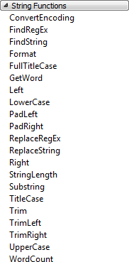
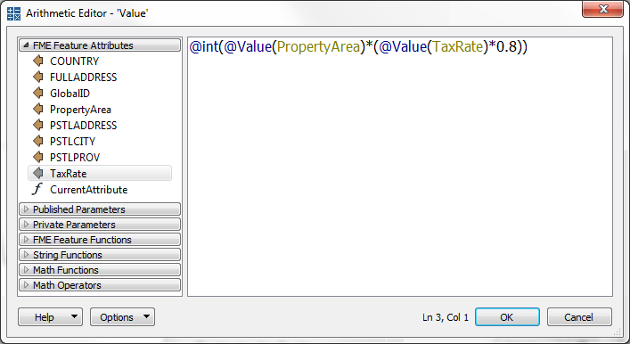

## Text Editor ##
The text editor - as you would expect - allows you to construct a text value. It includes all the usual string-handling functionality you would need, such as concatenation, trimming, padding, and case changing.

The text editor looks like this:

Here the user is constructing a simple address string by concatenating various existing attributes. Notice the menu on the left hand side. Existing attributes are listed here and were added into the string by double-clicking them.

Also notice the other menu options. The most important (for a text editor) are the String Functions:

These are the functions that can be used to manipulate the strings being used. For example, here the user is making sure the attributes being used are trimmed when used:

---

## Arithmetic Editor ##

The arithmetic editor is much the same as the text editor, except that whatever is entered into the dialog will be evaluated as an arithmetic expression and a numeric result returned:

Here the user is calculating a resident's tax using a simple equation containing property area and a tax code. As with the text editor, existing attributes and arithmetic functions were obtained from the menu on the left-hand side.

