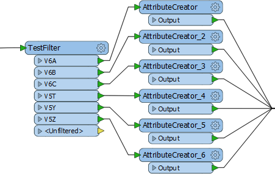
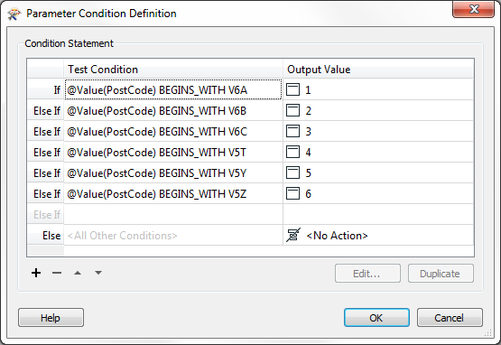
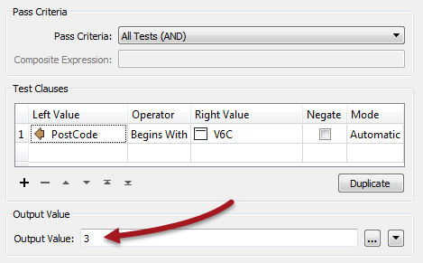
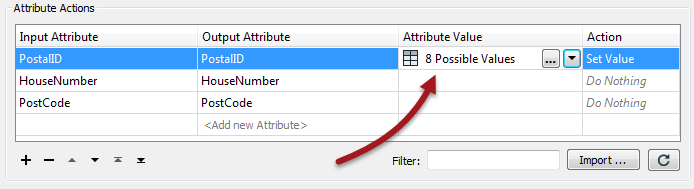

# Conditional Attribute Values

Conditional Attribute Values are a tool that can be used to replace many existing transformers of the same type.

## Transformer-Based Attribute Mapping ##

Features can be divided within a workspace using transformers in a process called Conditional Filtering, and attributes can be set or created based on these divisions:

This is just too many AttributeCreator transformers. Imagine if there were 100 values to handle! The workspace would be enormous!

One solution might be to use a simple AttributeValueMapper transformer. But that transformer only permits a simple condition. If a more advanced set of conditions is required, then we need to use Conditional Attribute Values.

## What are Conditional Attribute Values? ##

Conditional attribute values are when the author sets an attribute value inside a transformer, but also sets a number of conditions that must be first applied to the data.

The option for conditional attributes is found in the drop-down dialog on most transformer parameters. In the AttributeManager, it appears like so:

The Conditional Definition dialog (with values filled in) looks like this:

Like the AttributeValueMapper, a series of conditions (left) map to different values (right). However, in contrast to the AttributeValueMapper, this dialog allows much more complex conditions than a simple 1:1 mapping. That’s because full test capabilities are built into this dialog.

The conditions are defined by double-clicking in the Test Condition field to open up a Tester-style dialog. The output value can also be set within this Tester dialog:

---

<!--Person X Says Section-->

<table style="border-spacing: 0px">
<tr>
<td style="vertical-align:middle;background-color:darkorange;border: 2px solid darkorange">
<i class="fa fa-quote-left fa-lg fa-pull-left fa-fw" style="color:white;padding-right: 12px;vertical-align:text-top"></i>
Professor Lynn-Guistic says...
</td>
</tr>

<tr>
<td style="border: 1px solid darkorange">

The Output Value field does not necessarily need to be a "value"! It can be any action on the usual dropdown
menu, including Null or Stop Translation.
  
</td>
</tr>
</table>

---

When the conditions are set then the original dialog – in this case an AttributeManager – looks like this, with the number of conditions defining the number of possible values:

## When to use Conditional Attribute Values? ##

Conditional attribute values are great for when you need to map (or set) an attribute in relation to the value of an existing attribute, when the conditions are more complex than can be handled in a simple AttributeValueMapper or RangeValueMapper transformer.

<table style="border-spacing: 0px">
<tr>
<td style="vertical-align:middle;background-color:darkorange;border: 2px solid darkorange">
<i class="fa fa-quote-left fa-lg fa-pull-left fa-fw" style="color:white;padding-right: 12px;vertical-align:text-top"></i>
Professor Lynn Guistic says…
</td>
</tr>

<tr>
<td style="border: 1px solid darkorange">

If you’re using the ?: operator in an arithmetic editor, then you can stop being such a show-off and use conditional values instead.

</td>
</tr>
</table>

