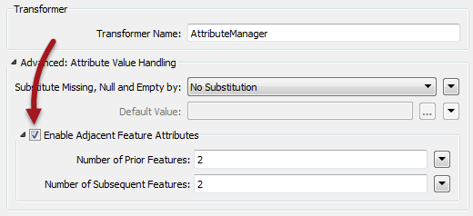
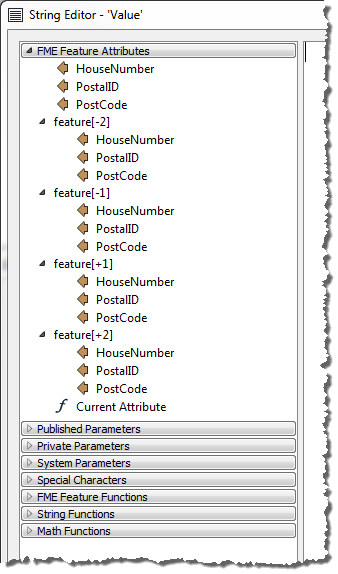
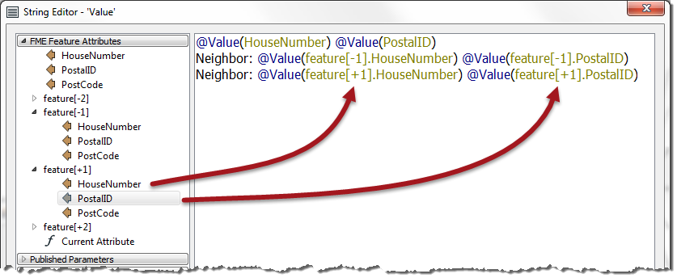
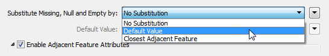

# Adjacent Feature Attributes

Normally a feature in FME is self-contained. It might get processed as a group at some point, but other than that it doesn’t have any sort of relationship to other features in the workspace.

However, in some cases the ability for a feature to access the attributes of other features would be quite useful.

For example, take a tabular dataset of coordinates that are recorded as follows:

<table>
<tr><th>X</th><th>Y</th></tr>
<tr><td>+0.0</td><td>+3.0</td></tr>
<tr><td>+3.2</td><td>+0.0</td></tr>
<tr><td>-3.2</td><td>+0.0</td></tr>
<tr><td>+0.0</td><td>+3.4</td></tr>
<tr><td>+4.2</td><td>+0.0</td></tr>
</table>

In this case each row is not an absolute coordinate; instead it is an offset from the previous one. Therefore, to calculate the true coordinates, each feature would need to know the coordinates of the previous feature, so that it could apply the offset.

This sort of scenario is catered for by Adjacent Feature Attributes in FME.

## Adjacent Feature Functionality ##

Adjacent Feature functionality is activated by checking the box labelled Enable Adjacent Feature Attributes in an AttributeCreator or AttributeManager transformer:

This opens up a section of dialog in which the author can specify how many features preceding the current feature, or how many features that succeed it, should be made available. In the above screenshot attributes from the previous and subsequent two features will become available.

So that's how to expose adjacent attributes, and using them is almost as simple.

## Using Multiple Feature Attributes ##

The simplest way to make use of the attributes retrieved from prior/subsequent features is through the text or arithmetic editors, where the list of feature attributes will have an expandable section for prior and subsequent features:

Notice above how attributes are available not only for the current feature, but also for the previous/subsequent two features. As with the current attribute, double-clicking an adjacent attribute adds it to the expression window:

In the above screenshot the user is creating a string composed of an address, and that of its neighbors (they won't be neighbors in a spatial sense unless the data is already sorted that way).

You can see that prior and subsequent attribute values can be accessed simply by using feature[x].<attribute name> where x is a positive or negative number that refers to a subsequent or prior feature.

---

<table style="border-spacing: 0px">
<tr>
<td style="vertical-align:middle;background-color:darkorange;border: 2px solid darkorange">
<i class="fa fa-quote-left fa-lg fa-pull-left fa-fw" style="color:white;padding-right: 12px;vertical-align:text-top"></i>
Professor Lynn Guistic says…
</td>
</tr>

<tr>
<td style="border: 1px solid darkorange">

This is a first-class piece of functionality, cool to the highest degree.
  However... be aware that extra system resources are used for storage of adjacent features. Therefore translation performance will take a (fairly minor) hit when using these capabilities, the degree of which depends on the number of attributes being retained.

</td>
</tr>
</table>

---

### Missing Values ###

The AttributeCreator and AttributeManager also have an option to specify what should happen if the attributes being used in a string are missing:

When the transformer tries to use a value that is missing (or null or empty) this options lets the user choose a replacement value, or to carry out no substitution.

Notice that this setting applies to attributes of the current feature, just as much as attributes of adjacent features. 

---

<!--Person X Says Section-->

<table style="border-spacing: 0px">
<tr>
<td style="vertical-align:middle;background-color:darkorange;border: 2px solid darkorange">
<i class="fa fa-quote-left fa-lg fa-pull-left fa-fw" style="color:white;padding-right: 12px;vertical-align:text-top"></i>
Miss Vector says...
</td>
</tr>

<tr>
<td style="border: 1px solid darkorange">

My AttributeManager sets up NewAttribute = OldAttribute + feature[+1].OldAttribute
  There are 100 features in my dataset. Given that feature[101].OldAttribute doesn't exist, what will the value of NewAttribute be for the 100th feature?
  1. No value at all (empty attribute)
 2. The same as feature[100].OldAttribute 
 3. It depends on the Substitute Value parameter
 4. FME will crash and explode your computer
</td>
</tr>
</table>

