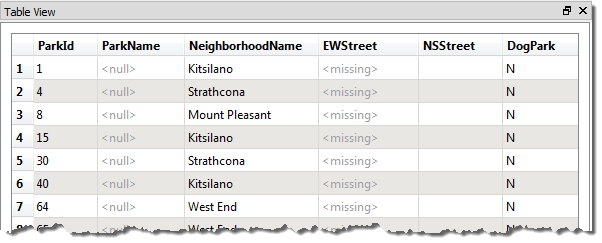
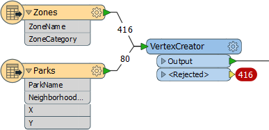

# Null Attributes #

Null attributes are a relatively new, but very important, part of FME’s attribute handling.

## What is a Null Value? ##

In general, a null attribute value is the equivalent of **nothing**. However, it’s important to be precise in our terminology because there are many ways to represent nothing:

- An attribute has a value that indicates nothingness (null)
- An attribute exists but has no value (empty)
- An attribute doesn’t exist (missing)
- A numeric attribute is NaN (Not a Number)
- A numeric attribute has a value of zero

In fact, Safe Software’s developers have identified fifteen (15) different ways for “nothing” to be represented in spatial and tabular data.

---

<table style="border-spacing: 0px">
<tr>
<td style="vertical-align:middle;background-color:darkorange;border: 2px solid darkorange">
<i class="fa fa-quote-left fa-lg fa-pull-left fa-fw" style="color:white;padding-right: 12px;vertical-align:text-top"></i>
Professor Lynn Guistic says…
</td>
</tr>

<tr>
<td style="border: 1px solid darkorange">

In case you are wondering, yes, our developers were the subject of many jokes for having spent six months "working on nothing"!

</td>
</tr>
</table>

---

So when we talk about *null*, it has a particular meaning. For us, a null is an actual value that is deliberately set to signify that the information does not exist. It tells us that the lack of information is not a mistake – as a missing or empty value might.

Because there are so many different methods, this section will discuss ways to handle "nothing" attribute values, but with a particular emphasis on Null values.

## How does FME Represent Nothing? ##
FME’s internal engine has its own state to represent null. However, when presented to the user, a null value is usually represented as &lt;null&gt;.

For example, this feature in the Logger has &lt;null&gt; for the ParkName attribute:

Similarly, the FME Data Inspector will depict nulls as &lt;null&gt;:

Notice how it differentiates between states by also displaying &lt;missing&gt; (when an attribute does not exist, like for EWStreet) or leaving the column blank (when an attribute exists but is empty, like NSStreet).

---

<table style="border-spacing: 0px">
<tr>
<td style="vertical-align:middle;background-color:darkorange;border: 2px solid darkorange">
<i class="fa fa-quote-left fa-lg fa-pull-left fa-fw" style="color:white;padding-right: 12px;vertical-align:text-top"></i>
Professor Lynn Guistic says…
</td>
</tr>

<tr>
<td style="border: 1px solid darkorange">

<strong>&lt;missing&gt;</strong> is an interesting concept. You might be asking, "how do we know when an attribute is missing"? But a better question is "how do we know that the attribute should exist"?
  We know it should exist because it appears in the schema defined in a Reader. For example, in the above screenshot, NSStreet appears in the schema, but for some reason these features do not have that attribute.
  Another common scenario where this happens, is when two streams of data are connected together. The attributes available to transformers will be the combination of the two streams, but each stream will only possess its own set of attributes.  
  
  Here, for example, the VertexCreator is rejecting 416 Zones features because the X/Y attributes it is using are &lt;missing&gt; from them!

</td>
</tr>
</table>