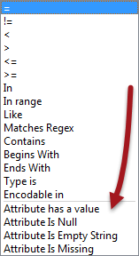
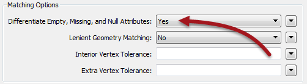

## Handling Nothing ##

Besides representing all forms of nothing in its interface, FME also allows nothing to be a condition in various tests, let's users set nothing values, and allows bulk updates from one form of nothing to another. 

### Recognizing Null Values ###

Various formats have various ways to represent nothing. But, if they support the concept of null, then FME will read any null attributes with a &lt;null&gt; value.

For a workspace to check for incoming nulls, the Tester transformer has specific operators to test for null, empty, and missing values:

Because the Tester interface is incorporated into many facets of FME (such as the TestFilter transformer) you can test for nulls wherever you find that interface.

---

<!--New Section--> 

<table style="border-spacing: 0px">
<tr>
<td style="vertical-align:middle;background-color:darkorange;border: 2px solid darkorange">
<i class="fa fa-bolt fa-lg fa-pull-left fa-fw" style="color:white;padding-right: 12px;vertical-align:text-top"></i>
NEW
</td>
</tr>

<tr>
<td style="border: 1px solid darkorange">

New for FME2016 is the "Attribute Has a Value" test. This test returns true when an attribute is not null, is not empty, and is not missing - saving you the inconvenience of having to use those three tests separately.

</td>
</tr>
</table>

---

Other transformers, such as the Matcher, also allow testing for nulls:

In the case of the Matcher the parameter decides whether null, empty, and missing values should be treated as different values. If set to No, then an attribute that is &lt;null&gt; is treated the same as an attribute that is &lt;missing&gt;. Otherwise, a match only occurs when &lt;null&gt; = &lt;null&gt; 

