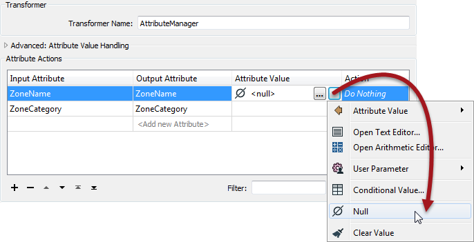
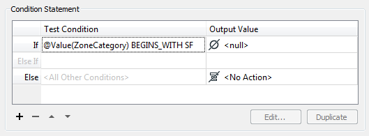
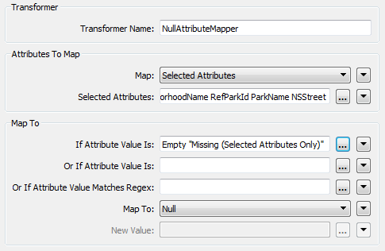
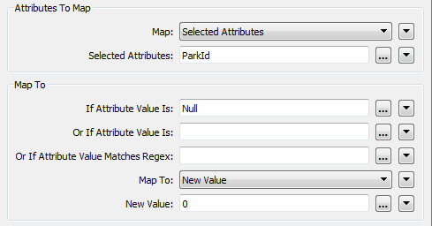

### Setting Null Values ###

The usual way to set an attribute value is with the AttributeCreator or AttributeManager, and these have an option in their drop-down menu to set a value to null:

The Conditional Attributes functionality in the AttributeManager also supports setting &lt;null&gt; values:

When you set an attribute to null, and send it to a Writer, then what happens depends upon the data format.

If the format supports nulls then the destination dataset will contain &lt;null&gt; attribute values.

If the format doesn’t support nulls, then FME will automatically convert the data to the closest representation that is supported.

---

### Bulk Null Updates ###

The way to handle bulk updates of attributes is with the NullAttributeMapper transformer.

The NullAttributeMapper transformer allows the author to check values for any or all attributes on a feature, and convert them in bulk to or from null.

For example, here the author is checking for attributes that are either missing or empty, and converting them to nulls:

Here the author is checking a specific attribute for existing null values. If the value is set to null then it gets replaced with a zero. Presumably this must be a numeric field. If it was a text field perhaps instead the author would set it to an empty string:

<table style="border-spacing: 0px">
<tr>
<td style="vertical-align:middle;background-color:darkorange;border: 2px solid darkorange">
<i class="fa fa-quote-left fa-lg fa-pull-left fa-fw" style="color:white;padding-right: 12px;vertical-align:text-top"></i>
Professor Lynn Guistic says…
</td>
</tr>

<tr>
<td style="border: 1px solid darkorange">

 It’s good to be aware of nulls and test workspaces when updating from FME versions prior to FME2014. Some formats and transformers may now be producing null values where before they would have been either empty
or missing.

</td>
</tr>
</table>

---

<!--Person X Says Section-->

<table style="border-spacing: 0px">
<tr>
<td style="vertical-align:middle;background-color:darkorange;border: 2px solid darkorange">
<i class="fa fa-quote-left fa-lg fa-pull-left fa-fw" style="color:white;padding-right: 12px;vertical-align:text-top"></i>
Miss Vector says...
</td>
</tr>

<tr>
<td style="border: 1px solid darkorange">

My Reader format supports nulls and includes known null values in the data. My Writer format is a simple text format that does not support nulls. What must I do to get my workspace to work correctly? 
  1. Delete the attributes with the AttributeRemover
 2. Set the advanced Reader parameter "Read Nulls as Empty" to Yes 
 3. Use the NullAttributeMapper to convert all &lt;null&gt; values to &lt;empty&gt;
 4. Nothing, the Writer will convert the values as necessary
</td>
</tr>
</table>
