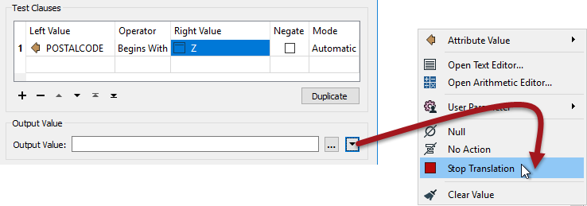

# Questions #

Here are the answers to the questions in this chapter.

---

<!--Person X Says Section-->

<table style="border-spacing: 0px">
<tr>
<td style="vertical-align:middle;background-color:darkorange;border: 2px solid darkorange">
<i class="fa fa-quote-left fa-lg fa-pull-left fa-fw" style="color:white;padding-right: 12px;vertical-align:text-top"></i>
Miss Vector says...
</td>
</tr>

<tr>
<td style="border: 1px solid darkorange">

Do you know which transformers can be used to create attributes? Select all that apply:
  1. AttributeCopier
 2. AttributeCreator
 3. AttributeManager
 4. AttributeRenamer
  The AttributeCreator is obvious and - hopefully - so is the AttributeManager. Other transformers may have allowed attribute creation at some point, but those capabilities should no longer be needed.

</td>
</tr>
</table>

---

<!--Person X Says Section-->

<table style="border-spacing: 0px">
<tr>
<td style="vertical-align:middle;background-color:darkorange;border: 2px solid darkorange">
<i class="fa fa-quote-left fa-lg fa-pull-left fa-fw" style="color:white;padding-right: 12px;vertical-align:text-top"></i>
Miss Vector says...
</td>
</tr>

<tr>
<td style="border: 1px solid darkorange">

The output attribute "value" in a conditional setup can be which of these (select all that apply):
  1. A simple value like a string or number
 2. A value constructed from a text or arithmetic editor
 3. No Action (i.e. the value will remain what it was)
 4. A command to FME to terminate the translation
  Yes, <strong>all</strong> of these are valid. You can type in a simple value or construct one with an editor, or even set the value to a user parameter. But the Output Value field also does not need to be a "value" at all! It can be any action on the usual dropdown menu, including Null, No Action, or Stop Translation.
   

</td>
</tr>
</table>

---

<!--Person X Says Section-->

<table style="border-spacing: 0px">
<tr>
<td style="vertical-align:middle;background-color:darkorange;border: 2px solid darkorange">
<i class="fa fa-quote-left fa-lg fa-pull-left fa-fw" style="color:white;padding-right: 12px;vertical-align:text-top"></i>
Miss Vector says...
</td>
</tr>

<tr>
<td style="border: 1px solid darkorange">

My AttributeManager sets up NewAttribute = OldAttribute + feature[+1].OldAttribute
  There are 100 features in my dataset. Given that feature[101].OldAttribute doesn't exist, what will the value of NewAttribute be for the 100th feature?
  1. No value at all (empty attribute)
 2. The same as feature[100].OldAttribute
 3. It depends on the Substitute Value parameter
 4. FME will crash and explode your computer
  You as the author get the choice of what happens when a value is missing, using the Substitute Value parameter, and that includes values that are missing because they are out of range. If you don't set a substitute value, then the result will be that NewAttribute is &lt;missing&gt; for feature 100.

</td>
</tr>
</table>

---

<!--Person X Says Section-->

<table style="border-spacing: 0px">
<tr>
<td style="vertical-align:middle;background-color:darkorange;border: 2px solid darkorange">
<i class="fa fa-quote-left fa-lg fa-pull-left fa-fw" style="color:white;padding-right: 12px;vertical-align:text-top"></i>
Miss Vector says...
</td>
</tr>

<tr>
<td style="border: 1px solid darkorange">

My Reader format supports nulls and includes known null values in the data. My Writer format is a simple text format that does not support nulls. What must I do to get my workspace to work correctly? 
  1. Delete the attributes with the AttributeRemover
 2. Set the advanced Reader parameter "Read Nulls as Empty" to Yes
 3. Use the NullAttributeMapper to convert all &lt;null&gt; values to &lt;empty&gt;
 4. Nothing, the Writer will convert the values as necessary
  If a format doesn't support nulls then the Writer will write the data in a format as close to null as possible for that format. Sometimes it will be an empty value, other formats have a specific value for null (like -9999). 

</td>
</tr>
</table>

