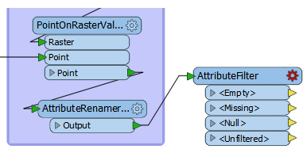
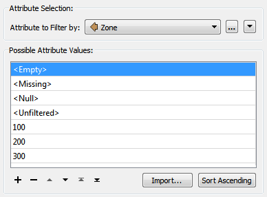
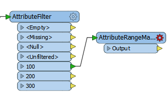
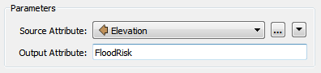
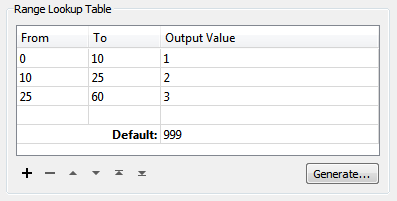
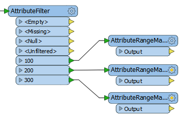

<!--Exercise Section-->
<!--NB: In GitBook world we don't give a number to exercises-->

<table style="border-spacing: 0px;border-collapse: collapse;font-family:serif">
<tr>
<td style="vertical-align:middle;background-color:darkorange;border: 2px solid darkorange">
<i class="fa fa-cogs fa-lg fa-pull-left fa-fw" style="color:white;padding-right: 12px;vertical-align:text-top"></i>

</td>
<td style="border: 2px solid darkorange;background-color:darkorange;color:white">
Flood Risk Project: Simple Filtering Method
</td>
</tr>

<tr>
<td style="border: 1px solid darkorange; font-weight: bold">Start Workspace</td>
<td style="border: 1px solid darkorange">C:\FMEData2016\Workspaces\DesktopAdvanced\Attributes-Ex2-Begin.fmw</td>
</tr>

<tr>
<td style="border: 1px solid darkorange; font-weight: bold">End Workspace</td>
<td style="border: 1px solid darkorange">C:\FMEData2016\Workspaces\DesktopAdvanced\Attributes-Ex2a-Complete.fmw</td>
</tr>

</table>

This simple filtering method is a two-step process involving an AttributeFilter and several AttributeRangeMapper transformers. You should already have the start workspace open.

 **1) Place AttributeFilter**
 Place an AttributeFilter connected to the AttributeRenamer:

Open the parameters dialog. Select Zone as the attribute to filter by. In the Attribute Values field enter the values 100, 200, and 300:

You could use the Import function, but for so few values it’s hardly worth it.

Click OK to close the dialog and you’ll see a new output port added for each value you specified.

 **2) Add AttributeRangeMapper**
 Add an AttributeRangeMapper transformer and connect it to the 100 output port of the AttributeFilter:

Open the parameters dialog. As you’ll see this is a lookup table that involves ranges. We should be able to map the elevation range to a final flood risk using the information in the original table.

So, select Elevation as the Source Attribute. Enter FloodRisk as the Output Attribute:

In the Range Lookup Table, enter the From-To values as follows:

<table>
<tr><th>From</th><th>To</th><th>Output Value</th></tr>
<tr><td>0</td><td>10</td><td>1</td></tr>
<tr><td>10</td><td>25</td><td>2</td></tr>
<tr><td>25</td><td>60</td><td>3</td></tr>
</table>

If an elevation falls exactly on one value (for example 25) it will be counted in the lower band (i.e. 10-25). Enter 999 as the Default, so that any features whose elevation does not match, for whatever reason, is flagged appropriately:

Click OK to close the dialog.

---

<!--Person X Says Section-->

<table style="border-spacing: 0px">
<tr>
<td style="vertical-align:middle;background-color:darkorange;border: 2px solid darkorange">
<i class="fa fa-quote-left fa-lg fa-pull-left fa-fw" style="color:white;padding-right: 12px;vertical-align:text-top"></i>
Miss Vector says...
</td>
</tr>

<tr>
<td style="border: 1px solid darkorange">

Hopefully you see that the Output Value numbers come from the flood risk table in the introduction to this exercise!

</td>
</tr>
</table>

---

 **3)** Duplicate AttributeRangeMapper
 Now we need to do the same thing for each of the other AttributeFilter output ports. Rather than set them up manually – as above – the easiest method is to copy the AttributeRangeMapper transformer that we just set up.

So, click on the existing AttributeRangeMapper and press Ctrl+D to duplicate it. Repeat and connect each duplicate to a different AttributeFilter output port.

The workspace will now look like this:

Now open the parameters dialog for each of the new AttributeRangeMapper transformers in turn and set up the correct Output Values in accordance with the original table of calculations.

The values will be:

<table>
<tr><td>100m Zone</td><td>1</td><td>2</td><td>3</td></tr>
<tr><td>200m Zone</td><td>2</td><td>3</td><td>4</td></tr>
<tr><td>300m Zone</td><td>3</td><td>4</td><td>5</td></tr>
</table>

 **4)** Add Inspector
 Place a single Inspector transformer and connect each AttributeRangeMapper output to it.

Open the Inspector parameters dialog and under Group-By select the newly created attribute called FloodRisk.

 **5)** Save and Run Workspace
 Save and run the workspace. You should see each address colored to match its flood risk. You can also turn off each zone in turn to see which addresses are most/least at risk.

---

<table style="border-spacing: 0px">
<tr>
<td style="vertical-align:middle;background-color:darkorange;border: 2px solid darkorange">
<i class="fa fa-quote-left fa-lg fa-pull-left fa-fw" style="color:white;padding-right: 12px;vertical-align:text-top"></i>
Professor Lynn Guistic says…
</td>
</tr>

<tr>
<td style="border: 1px solid darkorange">

If you’re sharp today, you’ll have noticed you could do this process in the reverse order. Instead of handling zone then elevation, you could handle elevation then zone using a combination of AttributeRangeFilter and
AttributeValueMapper transformers.

</td>
</tr>
</table>

---

<!--Exercise Congratulations Section--> 

<table style="border-spacing: 0px">
<tr>
<td style="vertical-align:middle;background-color:darkorange;border: 2px solid darkorange">
<i class="fa fa-thumbs-o-up fa-lg fa-pull-left fa-fw" style="color:white;padding-right: 12px;vertical-align:text-top"></i>
CONGRATULATIONS
</td>
</tr>

<tr>
<td style="border: 1px solid darkorange">

By completing this exercise you have learned how to:
<ul><li>Filter data with a simple test in order to subdivide it for attribute mapping</li>
<li>Map attribute values</li></ul>

</td>
</tr>
</table>