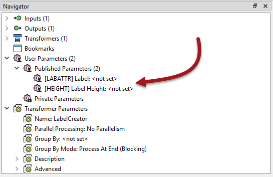
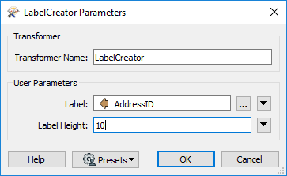
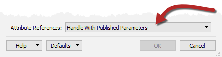
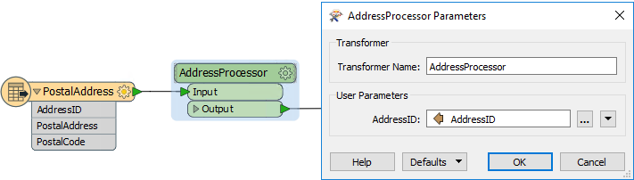

## Automatic Schema Handling ##

Let's look at how we can handle the schema complications that might arise if a custom transformer is reused.

### Automatic Handling of User Parameters ###
To take the handling of user parameters first, when a transformer with a published parameter is incorporated into a custom transformer, the published parameter is automatically moved from the main workspace to the custom transformer.

This means that the user is no longer prompted for these when the workspace is run! But... those parameters instead become available on the Custom Transformer itself:

That way the parameters can be set differently for each instance of the custom transformer. If user input is required at run-time, then these new parameters can be published themselves - and shared if you want them all to have the same value.

---

### Automatic Handling of User Attributes ###

Now let's look at how attributes are handled. When a custom transformer is created, one of the parameters in the Create Custom Transformer dialog is labelled Attribute References:

"Handle with Published Parameters" is the automatic way of handling attribute references in the custom transformer. It makes sure that every attribute referenced within the custom transformer is supported outside of the transformer definition.

It does that by creating a published parameter for each attribute:

...and then using that instead of the attribute reference:

Now, when this transformer is used in a place where the schema doesn't match, the transformer will still be flagged red as "incomplete". However... the user is able to use that published parameter to select an attribute that *is* available.

So (in the above) if AddressID is not available, the user can select ADDRESSID or AddressUUID instead.

---

<!--Person X Says Section-->

<table style="border-spacing: 0px">
<tr>
<td style="vertical-align:middle;background-color:darkorange;border: 2px solid darkorange">
<i class="fa fa-quote-left fa-lg fa-pull-left fa-fw" style="color:white;padding-right: 12px;vertical-align:text-top"></i>
First Officer Transformer says...
</td>
</tr>

<tr>
<td style="border: 1px solid darkorange">

Referring to my previous analogy, without an adapter I would need to manually open up my laptop's power supply, and rewire it with a new plug in order to use it overseas.
 However, this FME solution is like an adapter with a dial I just have to turn to the correct country setting.

</td>
</tr>
</table>

---

This illustrates how FME has automatically solved the attribute reference problem using published parameters. To make the custom transformer more generic, the workspace author can change the prompts on these parameters; for example change the prompt from "AddressID" to "Select an ID Attribute to Process".

---

<!--Person X Says Section-->

<table style="border-spacing: 0px">
<tr>
<td style="vertical-align:middle;background-color:darkorange;border: 2px solid darkorange">
<i class="fa fa-quote-left fa-lg fa-pull-left fa-fw" style="color:white;padding-right: 12px;vertical-align:text-top"></i>
Miss Vector says...
</td>
</tr>

<tr>
<td style="border: 1px solid darkorange">

What do you think would happen if you changed the parameter from "Handle with Published Parameters" to its other possible value, "Fix Manually (Advanced)"? Pick as many of these answers as you think are correct:
  <a href="http://52.73.3.37/fmedatastreaming/Manual/QAResponse2017.fmw?chapter=13&question=4&answer=1&DestDataset_TEXTLINE=C%3A%5CFMEOutput%5CQAResponse.html">1. The workspace won't run by default because no attributes are available in the custom transformer</a>
 <a href="http://52.73.3.37/fmedatastreaming/Manual/QAResponse2017.fmw?chapter=13&question=4&answer=2&DestDataset_TEXTLINE=C%3A%5CFMEOutput%5CQAResponse.html">2. There will be no way to pick attributes to use from the main canvas</a>
 <a href="http://52.73.3.37/fmedatastreaming/Manual/QAResponse2017.fmw?chapter=13&question=4&answer=3&DestDataset_TEXTLINE=C%3A%5CFMEOutput%5CQAResponse.html">3. The author will need to manually fix the custom transformer by exposing attributes in its definition</a>
 <a href="http://52.73.3.37/fmedatastreaming/Manual/QAResponse2017.fmw?chapter=13&question=4&answer=4&DestDataset_TEXTLINE=C%3A%5CFMEOutput%5CQAResponse.html">4. The custom transformer won't work on a different schema unless the exposed attributes are also published</a> 

</td>
</tr>
</table>

---