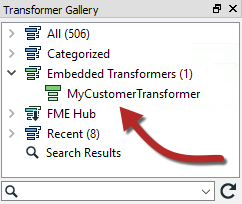
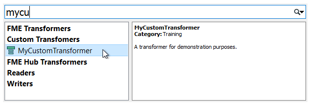
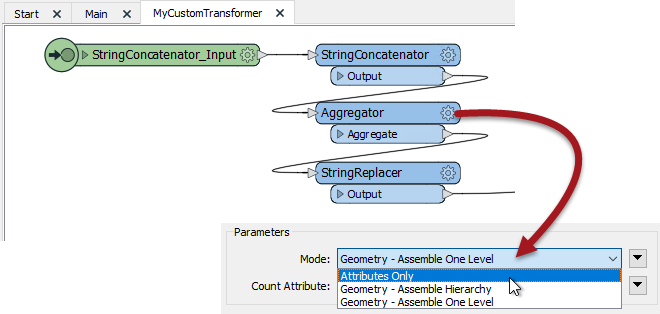

# Using Custom Transformers #

Once a custom transformer is created, it is placed into the main canvas and - apart from a different color - looks just like a normal FME transformer would.

However, the resemblance to a normal transformer is not just in appearance. In the same way that multiple instances of a transformer can be used in a workspace, a custom transformer can be used any number of times too. This makes Custom Transformers not just a way to tidy a workspace, but also as a way of re-using content.

To place extra copies of a custom transformer you use - again like a normal transformer - the Transformer Gallery (look under a section labelled “Embedded Transformers):

 

...or you can use Quick Add:

<table style="border-spacing: 0px">
<tr>
<td style="vertical-align:middle;background-color:darkorange;border: 2px solid darkorange">
<i class="fa fa-quote-left fa-lg fa-pull-left fa-fw" style="color:white;padding-right: 12px;vertical-align:text-top"></i>
FME Lizard says…
</td>
</tr>

<tr>
<td style="border: 1px solid darkorange">

The transformer name, category, and description all appear in the Quick Add tool - as well as appearing in the help window - so it is definitely worthwhile setting these parameters.

</td>
</tr>
</table>

---

## Editing a Re-used Custom Transformer ##

Multiple instances of a custom transformer all use the same core definition; i.e. there may be multiple instances on the Main canvas, but only a single definition exists for all of them 

A key benefit of this approach is that *every* instance is updated or edited when the custom transformer definition is changed.

For example, if a parameter is changed for the Aggregator inside this custom transformer:

...then the parameter automatically changes for ALL instances of the transformer that have been placed.

Editing is simpler because changes only need to be made once, no matter how many times that custom transformer has been used.