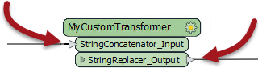
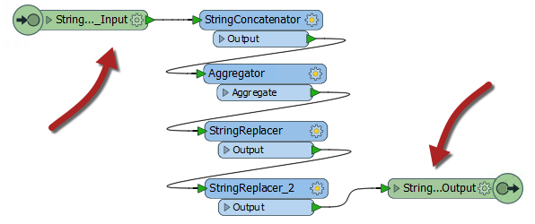
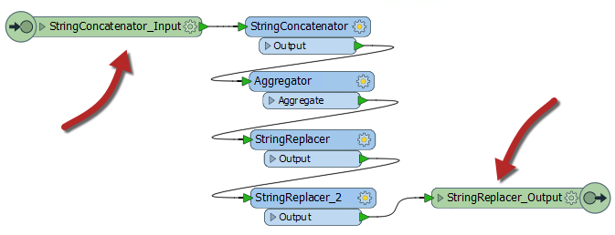
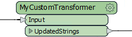
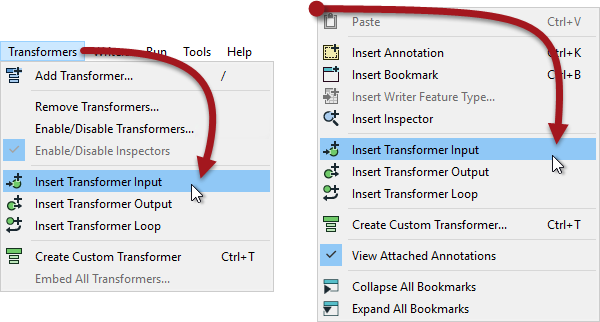
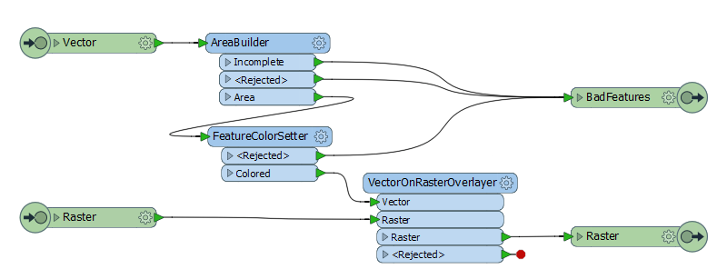
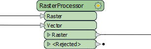
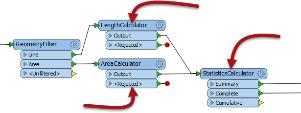

## Custom Transformer Input/Output Ports ##

Again, like a normal FME transformer, a custom transformer has a number of input and output ports:

These input and output ports are defined by input/output objects in the custom transformer definition itself:

### Renaming Ports ###

The first thing to know is that these input/output objects can be renamed, in order that the transformer ports get named appropriately. You can either double-click the object, choose Rename from the context menu, or press F2, in order to rename the object.

For example, here the user pressed F2 and renames the input port from StringConcatenator_Input to simply Input:

 

Renaming the input and output ports is useful for making the custom transformer intentions more explicit; for instance, helping the user to understand what data type is required as input.

For example, after editing the transformer might look like this:

---

<!--Person X Says Section-->

<table style="border-spacing: 0px">
<tr>
<td style="vertical-align:middle;background-color:darkorange;border: 2px solid darkorange">
<i class="fa fa-quote-left fa-lg fa-pull-left fa-fw" style="color:white;padding-right: 12px;vertical-align:text-top"></i>
FME Lizard says...
</td>
</tr>

<tr>
<td style="border: 1px solid darkorange">

Here the user simply renamed the input port to Input. Renaming it to "Strings", "Lines", or "Raster" (for example) would help guide other users of the transformer as to what data is required. 
  However, they did rename the output port to illustrate the type of data that will emerge.

</td>
</tr>
</table>

---

### Adding or Removing Ports ###

Besides renaming ports, it is also possible to add new ports to a custom transformer.

To do so simply select Transformer Input (or Output) from either the menubar or the canvas context (right-click) menu:

For example, here a user has ports to handle two streams of input data and two streams of output (one port for the required output, another that handles rejected features:

This means that each instance of the custom transformer has two input and two output ports:

---

<!--Person X Says Section-->

<table style="border-spacing: 0px">
<tr>
<td style="vertical-align:middle;background-color:darkorange;border: 2px solid darkorange">
<i class="fa fa-quote-left fa-lg fa-pull-left fa-fw" style="color:white;padding-right: 12px;vertical-align:text-top"></i>
FME Lizard asks...
</td>
</tr>

<tr>
<td style="border: 1px solid darkorange">

<quiz name="">
  <question>
    

      Q) Which of these is NOT a reason to use Custom Transformers?
    

    <answer correct>To make my content available in Quick Add</answer>
    <answer>To use advanced functionality like looping</answer>
    <answer>To reuse chunks of content in a simple way</answer>
    <answer>To tidy and declutter the main workspace canvas</answer>
      <explanation>A) Making content available in Quick Add is not a good reason to use a Custom Transformer. Admittedly your content <strong>does</strong> become available in Quick Add, but that's not a specific reason to create a custom transformer. The reason you want it in Quick Add is so that you can reuse the content.</explanation>
  </question>

  <question>
    

      Q) Consider this section of workspace:
        
        If I select the three transformers highlighted with arrows, and create a custom transformer, how many input and output ports will it have by default?
    

    <answer>One Input and One Output port</answer>
    <answer>One Input and Two Output ports</answer>
    <answer correct>Two Input and Two Output ports</answer>
    <answer>Two Input and Three Output ports</answer>
      <explanation>A) It will have two input and two output ports, proving that FME will automatically create multiple ports where required. There are two inputs because there are two connections entering the set of transformers, and two outputs because there are two connections exiting the set of transformers (although there are three output ports on the StatisticsCalculator, only two are connected)</explanation>
  </question>
</quiz>
</tr>
</table>