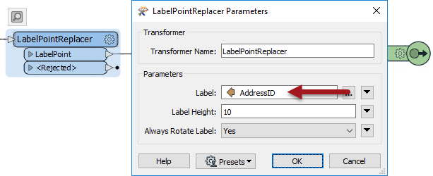

# Custom Transformers and Parameter Input

FME transformers all have parameters whose value can be supplied by *attributes* or by *user input*. The same is still true of transformers inside a custom transformer definition. However, because a custom transformer can be reused in multiple places, it's important for these inputs to be flexible.

## Parameter Input by Attributes ##

Many transformer parameters can be set up to accept values from attributes. 

Take this custom transformer that creates custom map labels:

Inside that custom transformer is a LabelPointReplacer transformer. It uses AddressID as the value for the label:

As created, the custom transformer works fine. However, consider if that transformer is used elsewhere, where AddressID does not exist:

This transformer is flagged as "incomplete". It is used in a scenario where AddressID is not available. 

## Parameter Input by User Parameters ##

Besides attributes, most FME parameters can be set up to accept values from User Parameters. 

In a similar setup to above, here a custom transformer contains a LabelPointReplacer transformer whose label value is selected by user input:

Here the issue is not *where* the custom transformer is used, but its duplication. If each instance of the custom transformer uses the same user parameter, then they will all get the same input. 

We need a mechanism for the user to enter different values per transformer instance.

---

<!--Person X Says Section-->

<table style="border-spacing: 0px">
<tr>
<td style="vertical-align:middle;background-color:darkorange;border: 2px solid darkorange">
<i class="fa fa-quote-left fa-lg fa-pull-left fa-fw" style="color:white;padding-right: 12px;vertical-align:text-top"></i>
FME Lizard says...
</td>
</tr>

<tr>
<td style="border: 1px solid darkorange">

As an analogy, consider a mobile device such as a cell phone. On my phone I can change the default language from English to (for example) Swedish. The manufacturer implemented this because they have no way to tell <strong>where</strong> the phone might be used, or by who, or what language might be used for input. 
  In much the same way, an FME custom transformer could be used outside of its expected area. The author must therefore implement the transformer to be adaptable to different inputs. This can be done either automatically or manually...

</td>
</tr>
</table>
 