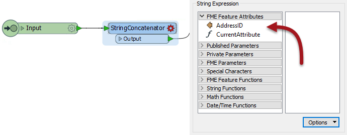
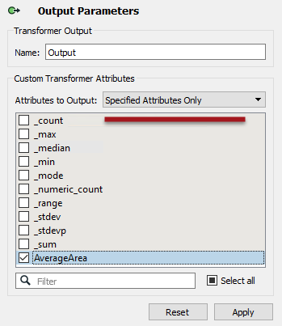

## Post-Creation Schema Handling ##

As we know, custom transformers can be edited after creation. 

The "Handle with Published Parameters" setting handles attributes used in a custom transformer *only when it is created*. There also needs to be a mechanism for handling future edits to a custom transformer (or where the custom transformer is simply created from scratch).

### Handling Incoming Attributes ###

Attributes entering a custom transformer are handled using a setting inside the transformer definition.

As an example, an author puts a StringConcatenator inside a newly created custom transformer. The author wishes to concatenate AddressID and PostalCode.

AddressID is available in the custom transformer because it was being used when the custom transformer was created (and Handle With Published Parameters was set).

However, PostalCode is not available. It was not being used when the custom transformer was created. 

Therefore the author must expose that attribute. They do so by inspecting the parameters for the Input port, where they are able to specify other incoming attributes to expose:

Now PostalCode becomes available to the StringConcatenator and, additionally, made into a user parameter so that back on the main canvas the custom transformer can accept a different attribute selection should PostalCode not be available.

### Handling Outgoing Attributes ##

Besides incoming attributes, there is also the question of what attributes should emerge from the output of a custom transformer.

Best Practice suggests that we shouldn't output more attributes than are expected by the user. We should hide or remove any attributes that are part of a calculation, or any attributes that are otherwise generated inside the custom transformer but aren’t necessary to the output.

Here a custom transformer is calculating the average area of a number of polygon features. It has renamed ports and a specific output port to deal with bad features, but it is outputting more attributes than are useful:

The workspace author should clean up this output. They can do this by visiting the custom transformer definition, viewing the output port object, and there choosing which attributes are to be output:

The Attributes to Output setting gives the option of outputting all attributes, or only those that have a checkmark next to them, as above.
