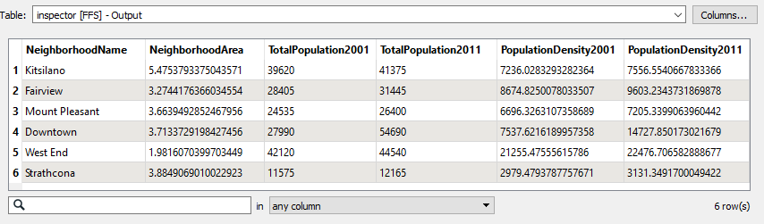
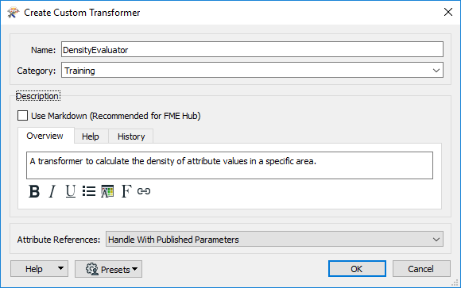
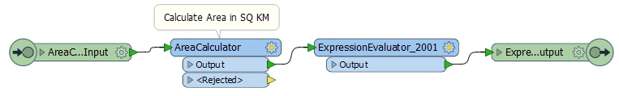
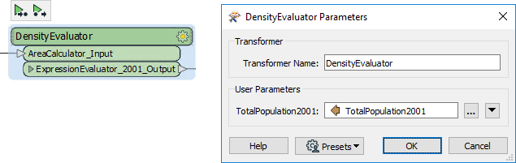

<!--Exercise Section-->

<table style="border-spacing: 0px;border-collapse: collapse;font-family:serif">
<tr>
<td style="vertical-align:middle;background-color:darkorange;border: 2px solid darkorange">
<i class="fa fa-cogs fa-lg fa-pull-left fa-fw" style="color:white;padding-right: 12px;vertical-align:text-top"></i>
Exercise 1
</td>
<td style="border: 2px solid darkorange;background-color:darkorange;color:white">
Creating a Custom Transformer
</td>
</tr>

<tr>
<td style="border: 1px solid darkorange; font-weight: bold">Data</td>
<td style="border: 1px solid darkorange">Neighborhoods (Google KML)</td>
</tr>

<tr>
<td style="border: 1px solid darkorange; font-weight: bold">Overall Goal</td>
<td style="border: 1px solid darkorange">Create a custom transformer out of a workspace</td>
</tr>

<tr>
<td style="border: 1px solid darkorange; font-weight: bold">Demonstrates</td>
<td style="border: 1px solid darkorange">Basic custom transformer creation</td>
</tr>

<tr>
<td style="border: 1px solid darkorange; font-weight: bold">Start Workspace</td>
<td style="border: 1px solid darkorange">C:\FMEData2018\Workspaces\DesktopAdvanced\CustomTransformers-Ex1-Begin.fmw</td>
</tr>

<tr>
<td style="border: 1px solid darkorange; font-weight: bold">End Workspace</td>
<td style="border: 1px solid darkorange">C:\FMEData2018\Workspaces\DesktopAdvanced\CustomTransformers-Ex1-Complete.fmw</td>
</tr>

</table>

A colleague - new to FME - has created a workspace that calculates the population density for neighborhoods in the city of Vancouver, and comments that this technique could be reused for other projects.

You mention custom transformers as a way of doing this and will now demonstrate to her how to turn this workspace into a general solution that calculates the average density of items in a known space.

 **1) Start Workbench**
 Start by opening your colleague's workspace: C:\FMEData2018\Workspaces\DesktopAdvanced\CustomTransformers-Ex1-Begin.fmw

You may wish to run the workspace and examine the output to see what it does and how it works. Basically it calculates the population density (persons per square kilometre) for the years 2001 and 2011:

 **2) Create Custom Transformer**
 The key components for the custom transformer are the AreaCalculator and ExpressionEvaluator transformers. If you examine the workspace you’ll see two ExpressionEvaluators (one for the year 2001, one for 2011) but we don’t need to include both in the custom transformer.

So select the AreaCalculator transformer and ExpressionEvaluator_2001 (the first ExpressionEvaluator), right-click on them, and choose the context menu option *Create Custom Transformer* (or just press Ctrl+T).

In the Create Custom Transformer dialog enter a name, category, and description for the new custom transformer. A good name for the transformer will be the DensityEvaluator.

---

<table style="border-spacing: 0px">
<tr>
<td style="vertical-align:middle;background-color:darkorange;border: 2px solid darkorange">
<i class="fa fa-quote-left fa-lg fa-pull-left fa-fw" style="color:white;padding-right: 12px;vertical-align:text-top"></i>
First Officer Transformer says…
</td>
</tr>

<tr>
<td style="border: 1px solid darkorange">

You can’t call it the DensityCalculator; FME already has one of those!

</td>
</tr>
</table>

---

Be sure the Attribute References parameter is set to “Handle with Published Parameters” (more on that later) and click OK:

The custom transformer will now be created.

 **3) Inspect Custom Transformer**
 Flip back and forth between the DensityEvaluator tab and the Main tab to see how the custom transformer is constructed, and how it is placed in the workspace itself.

Back in the Main tab, inspect the parameters for the custom transformer.

The main parameter is one created automatically by FME to accept the attribute to be processed. You'll see it is automatically preset to the TotalPopulation2001 attribute.

 **4) Run Workspace**
 Save the workspace and then run the workspace, to ensure the output has not changed. However, note that this is just the start of this custom transformer, and we should tidy it up (make it more generic) before trying to reuse it in other scenarios.

---

<table style="border-spacing: 0px">
<tr>
<td style="vertical-align:middle;background-color:darkorange;border: 2px solid darkorange">
<i class="fa fa-quote-left fa-lg fa-pull-left fa-fw" style="color:white;padding-right: 12px;vertical-align:text-top"></i>
Miss Vector says…
</td>
</tr>

<tr>
<td style="border: 1px solid darkorange">

Why do you think that we left the CSMapReprojector transformer out of our custom transformer? <a href="http://52.73.3.37/fmedatastreaming/Manual/QAResponse2017.fmw?chapter=13&question=3&answer=1&DestDataset_TEXTLINE=C%3A%5CFMEOutput%5CQAResponse.html">Any ideas?</a>

</td>
</tr>
</table>

---

<!--Exercise Congratulations Section--> 

<table style="border-spacing: 0px">
<tr>
<td style="vertical-align:middle;background-color:darkorange;border: 2px solid darkorange">
<i class="fa fa-thumbs-o-up fa-lg fa-pull-left fa-fw" style="color:white;padding-right: 12px;vertical-align:text-top"></i>
CONGRATULATIONS
</td>
</tr>

<tr>
<td style="border: 1px solid darkorange">

By completing this exercise you have learned how to:
<ul><li>Create custom transformers from a sequence of existing transformers</li>
<li>Handle attribute references automatically in a custom transformer</li></ul>

</td>
</tr>
</table>