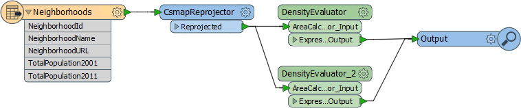
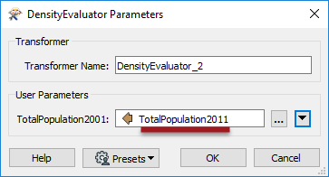
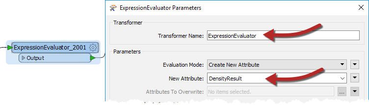
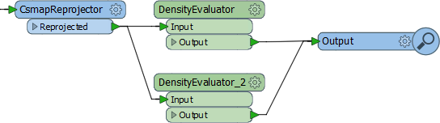

<!--Exercise Section-->

<table style="border-spacing: 0px;border-collapse: collapse;font-family:serif">
<tr>
<td style="vertical-align:middle;background-color:darkorange;border: 2px solid darkorange">
<i class="fa fa-cogs fa-lg fa-pull-left fa-fw" style="color:white;padding-right: 12px;vertical-align:text-top"></i>
Exercise 2
</td>
<td style="border: 2px solid darkorange;background-color:darkorange;color:white">
Editing a Custom Transformer
</td>
</tr>

<tr>
<td style="border: 1px solid darkorange; font-weight: bold">Data</td>
<td style="border: 1px solid darkorange">Neighborhoods (Google KML)</td>
</tr>

<tr>
<td style="border: 1px solid darkorange; font-weight: bold">Overall Goal</td>
<td style="border: 1px solid darkorange">Make use of a custom transformer created out of a workspace</td>
</tr>

<tr>
<td style="border: 1px solid darkorange; font-weight: bold">Demonstrates</td>
<td style="border: 1px solid darkorange">Basic custom transformer re-use and editing</td>
</tr>

<tr>
<td style="border: 1px solid darkorange; font-weight: bold">Start Workspace</td>
<td style="border: 1px solid darkorange">C:\FMEData2019\Workspaces\DesktopAdvanced\CustomTransformers-Ex2-Begin.fmw</td>
</tr>

<tr>
<td style="border: 1px solid darkorange; font-weight: bold">End Workspace</td>
<td style="border: 1px solid darkorange">C:\FMEData2019\Workspaces\DesktopAdvanced\CustomTransformers-Ex2-Complete.fmw</td>
</tr>

</table>

A colleague - new to FME - has created a workspace that calculates the population density for neighborhoods in the city of Vancouver, and comments that this technique could be reused for other projects.

We've turned her workspace into a custom transformer as a way of doing this and now need to show how to use it multiple times and apply edits to its definition.

 **1) Start Workbench**
 Continue with the workspace from exercise 1, or open the workspace: C:\FMEData2019\Workspaces\DesktopAdvanced\CustomTransformers-Ex2-Begin.fmw

 **2) Duplicate Custom Transformer**
 Notice that we started with two ExpressionEvaluators and now have one ExpressionEvaluator and one custom transformer. Let's place another instance of the custom transformer in place of the ExpressionEvaluator.

Click on the ExpressionEvaluator_2011 and press the <kbd>delete</kbd> key to delete it.

Click on the DensityEvaluator custom transformer and press <kbd>Ctrl</kbd>+<kbd>D</kbd> (or right-click &gt; duplicate) to create a duplicate copy of it. This is the same effect as placing a new instance, but quicker. You could do the same task through Quick Add or the Transformer Gallery if you desired.

Connect the second DensityEvaluator into the workflow, in parallel and not in series:

 **3) Set Custom Transformer Parameters**
 By creating a second instance of the custom transformer we've started to re-use our content, which is great. However, the second instance is currently processing the wrong data.

Inspect the parameters for the second DensityEvaluator and set the population parameter to TotalPopulation2011 (not 2001):

 **4) Run Workspace**
 Run the workspace and inspect the output to ensure the data is being processed correctly.

One obvious problem with the output from the transformer is that the result is put into an attribute called PopulationDensity2001, regardless of what data is being processed. 

This is not useful; for example, the 2011 results also get the same name, as would any other scenario where we used this transformer. We should improve this by making the output name more generic.

 **5) Edit Custom Transformer**
 Click on the tab labeled DensityEvaluator to switch the canvas to the custom transformer definition. Inspect the ExpressionEvaluator_2001 parameters. Change the Transformer name to ExpressionEvaluator since we are processing more than just 2001 data. Then change the name of the New Attribute parameter to DensityResult:

If you run the workspace again (run it from at leasst the custom transformer onwards) you’ll notice that DensityResult is the attribute output by both instances of the custom transformer; i.e. one edit has fixed both of them!

 **6) Rename Ports**
 One other edit we ought to make is to the port names of the custom transformer. At the moment they are not very elegant.

Back within the DensityEvaluator tab, click the cogwheel icon of the input port object (currently labeled AreaCalculator_Input). Inspect its parameters and change the name to Input.

Now repeat the process for the output port object, renaming it to Output:

Click the Main tab to check back on the main canvas and confirm the changes have been made:

You'll need to manually resize the transformers to fit their new naming style, as in the above image.

---

<!--Exercise Congratulations Section--> 

<table style="border-spacing: 0px">
<tr>
<td style="vertical-align:middle;background-color:darkorange;border: 2px solid darkorange">
<i class="fa fa-thumbs-o-up fa-lg fa-pull-left fa-fw" style="color:white;padding-right: 12px;vertical-align:text-top"></i>
CONGRATULATIONS
</td>
</tr>

<tr>
<td style="border: 1px solid darkorange">

By completing this exercise you have learned how to:
<ul><li>Use multiple instances of a custom transformer</li>
<li>Make a custom transformer generic for use anywhere</li>
<li>Rename input and output ports in a custom transformer</li></ul>

</td>
</tr>
</table>