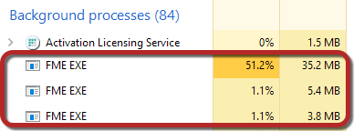
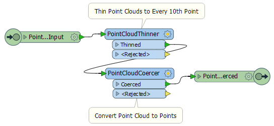
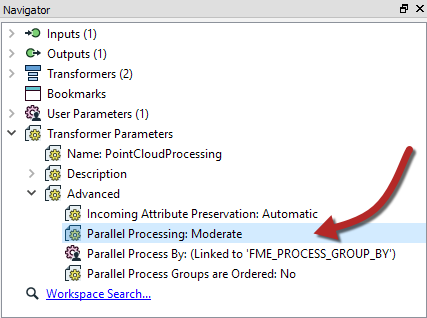
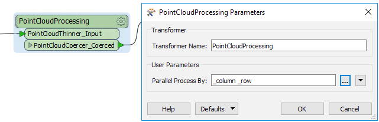

<!--Exercise Section-->

<table style="border-spacing: 0px;border-collapse: collapse;font-family:serif">
<tr>
<td style="vertical-align:middle;background-color:darkorange;border: 2px solid darkorange">
<i class="fa fa-cogs fa-lg fa-pull-left fa-fw" style="color:white;padding-right: 12px;vertical-align:text-top"></i>
Exercise 5
</td>
<td style="border: 2px solid darkorange;background-color:darkorange;color:white">
Custom Transformers and Parallel Processing
</td>
</tr>

<tr>
<td style="border: 1px solid darkorange; font-weight: bold">Data</td>
<td style="border: 1px solid darkorange">3D Point Clouds (ASPRS Lidar Data Exchange Format (LAS))</td>
</tr>

<tr>
<td style="border: 1px solid darkorange; font-weight: bold">Overall Goal</td>
<td style="border: 1px solid darkorange">Create a custom transformer to parallel process data</td>
</tr>

<tr>
<td style="border: 1px solid darkorange; font-weight: bold">Demonstrates</td>
<td style="border: 1px solid darkorange">Custom Transformers and Parallel Processing</td>
</tr>

<tr>
<td style="border: 1px solid darkorange; font-weight: bold">Start Workspace</td>
<td style="border: 1px solid darkorange">C:\FMEData2019\Workspaces\DesktopAdvanced\CustomTransformers-Ex5-Begin.fmw</td>
</tr>

<tr>
<td style="border: 1px solid darkorange; font-weight: bold">End Workspace</td>
<td style="border: 1px solid darkorange">C:\FMEData2019\Workspaces\DesktopAdvanced\CustomTransformers-Ex5-Complete.fmw</td>
</tr>

</table>

The city has recently started collecting point cloud data and now it is ready for sharing with different departments. You have been asked to create a solution that converts the point clouds to a vector format that other departments can use. 

You quickly create a great workspace that nicely tiles and thins the data too so the destination datasets aren’t overwhelming in terms of size.

However... the workspace takes longer to run than you like. Because it will be run on a daily basis it would be useful to speed up the translation using parallel processing.

Since none of the transformers used has a parallel processing parameter, you’ll have to create a custom transformer to do this.

 **1) Open Workspace**
 Open the workspace C:\FMEData2019\Workspaces\DesktopAdvanced\CustomTransformers-Ex5-Begin.fmw.

As you’ll see, this workspace processes some incoming point cloud data. Inspect the data to see what we’re dealing with. If you run the workspace as-is it will take approximately three minutes. To make it run a little faster you can increase the Thinning Interval parameter in the PointCloudThinner (say to 25).

Open a task manager (process manager) tool for your operating system. Run the workspace. You’ll see an FME engine process running (fme.exe). If there is more than one then any other could be FME Server engine; a low CPU use indicates a Server engine idling while it waits for a new job:

---

<table style="border-spacing: 0px">
<tr>
<td style="vertical-align:middle;background-color:darkorange;border: 2px solid darkorange">
<i class="fa fa-quote-left fa-lg fa-pull-left fa-fw" style="color:white;padding-right: 12px;vertical-align:text-top"></i>
First Officer Transformer says…
</td>
</tr>

<tr>
<td style="border: 1px solid darkorange">

You’ll also see an fmeworkbench.exe process, which is the process running the Workbench interface. This <b>isn’t</b> responsible for processing the workspace; the two are completely separate processes.

</td>
</tr>
</table>

---

 **2) Create Custom Transformer**
 Now select the PointCloudThinner and PointCloudCoercer transformers and turn them into a custom transformer. 

It's important you don’t include the Tiler transformer, as this is creating the tiles that we’ll be using as a way to parallel process.

You can call the transformer something like PointCloudProcessing. It doesn’t matter what attribute reference handling you choose.

The transformer definition should look something like this:

 **3) Set Parallel Processing**
 In the Navigator window (of the custom transformer definition) locate and expand the section of custom transformer advanced parameters.

Double-click the Parallel Processing parameter to set it. Set the processing level to Moderate.

Click OK to close the dialog and you’ll notice the Parallel Process By parameter is now published.

 **4) Set Process By**
 Return to the main canvas and inspect the parameters for the custom transformer instance. Select both _column and _row as the attributes to Parallel Process By:

This means that each unique combination of _column and _row (i.e. each tile) will be run under a separate process, up to a maximum of one process per core processor.

 **5) Run Workspace**
 Run the workspace, again with a task manager or process monitor window open. Once the tiling is complete and the rest of the workspace is being processed, you’ll notice a number of FME worker processes (fmeworker.exe):

In moderate mode, you’ll see up to one fmeworker process for each core. This time the translation should - given enough system resources like memory - be complete in a much faster time.

---

<!--Warning Section-->

<table style="border-spacing: 0px">
<tr>
<td style="vertical-align:middle;background-color:darkorange;border: 2px solid darkorange">
<i class="fa fa-exclamation-triangle fa-lg fa-pull-left fa-fw" style="color:white;padding-right: 12px;vertical-align:text-top"></i>
WARNING
</td>
</tr>

<tr>
<td style="border: 1px solid darkorange">

Absolutely do NOT run this in "breakpoint mode". If you do, parallel processing won't work!
 You are in breakpoint mode when Run with Breakpoints is set under the Run menu - whether or not you have any breakpoints set!
  Similarly, do NOT run this with feature caching turned on. Make sure Run with Feature Caching under the Run menu is not checked.

</td>
</tr>
</table>

---

 **6) Experiment with Parallel Processing Level**
 If you have time, re-run the workspace with a different processing level, say Aggressive. Does it run any quicker than the Moderate processing level? If not, why might that be? Does adjusting the number of tiles make it better or worse?

---

<!--Exercise Congratulations Section--> 

<table style="border-spacing: 0px">
<tr>
<td style="vertical-align:middle;background-color:darkorange;border: 2px solid darkorange">
<i class="fa fa-thumbs-o-up fa-lg fa-pull-left fa-fw" style="color:white;padding-right: 12px;vertical-align:text-top"></i>
CONGRATULATIONS
</td>
</tr>

<tr>
<td style="border: 1px solid darkorange">

By completing this exercise you have learned how to:
<ul><li>Create and use parallel processing in a custom transformer</li>
<li>Confirm with the task manager that FME is launching worker processes</li></ul>

</td>
</tr>
</table>
