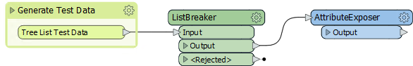
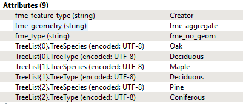
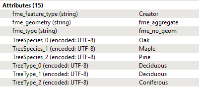
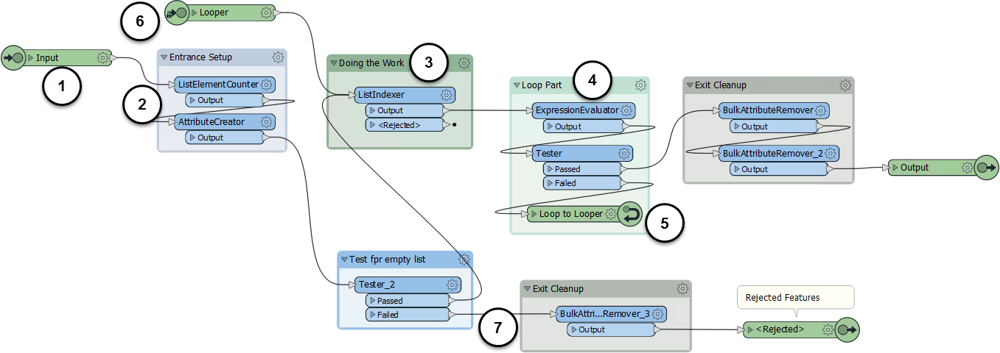
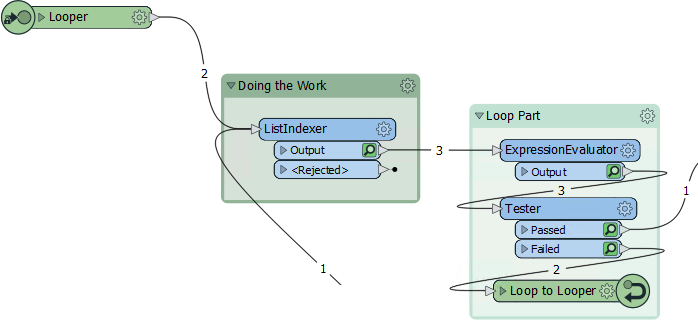
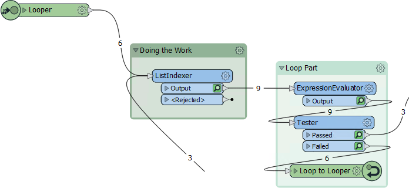
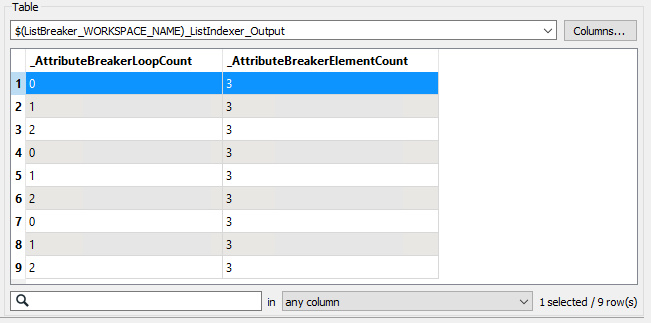
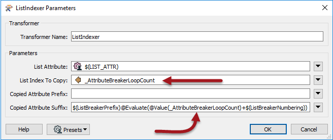
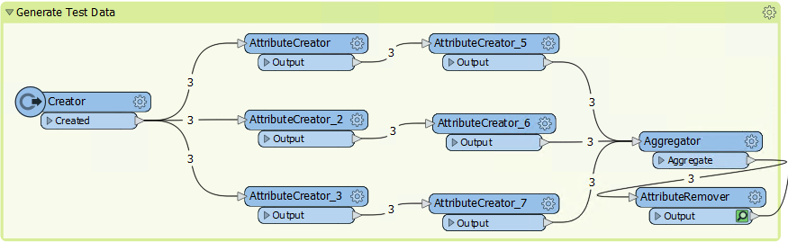

<!--Exercise Section-->

<table style="border-spacing: 0px;border-collapse: collapse;font-family:serif">
<tr>
<td style="vertical-align:middle;background-color:darkorange;border: 2px solid darkorange">
<i class="fa fa-cogs fa-lg fa-pull-left fa-fw" style="color:white;padding-right: 12px;vertical-align:text-top"></i>
Exercise 6
</td>
<td style="border: 2px solid darkorange;background-color:darkorange;color:white">
Looping in a Custom Transformer
</td>
</tr>

<tr>
<td style="border: 1px solid darkorange; font-weight: bold">Data</td>
<td style="border: 1px solid darkorange">Tree List</td>
</tr>

<tr>
<td style="border: 1px solid darkorange; font-weight: bold">Overall Goal</td>
<td style="border: 1px solid darkorange">Examine a custom transformer that breaks a list into pieces</td>
</tr>

<tr>
<td style="border: 1px solid darkorange; font-weight: bold">Demonstrates</td>
<td style="border: 1px solid darkorange">Custom Transformers and Loops</td>
</tr>

<tr>
<td style="border: 1px solid darkorange; font-weight: bold">Start Workspace</td>
<td style="border: 1px solid darkorange">None</td>
</tr>

<tr>
<td style="border: 1px solid darkorange; font-weight: bold">End Workspace</td>
<td style="border: 1px solid darkorange">C:\FMEData2019\Workspaces\DesktopAdvanced\CustomTransformers-Ex6-Complete.fmw</td>
</tr>

</table>

In this exercise, we'll examine a custom transformer that includes a loop inside it, to see how it works.

---

 **1) Open and Run Workspace**
 Start FME Workbench and open the workspace CustomTransformers-Ex6-Complete.fmw.

The workspace generates a set of test data and then processes it with a custom transformer called the ListBreaker. Run the workspace, being sure to use Run &gt; Rerun Entire Workspace from either the menubar or toolbar.

Inspect the output of the test data bookmark, and the ListBreaker transformer. Notice that the test data starts out with a list of tree types and species:

After processing, the list has been broken down into a set of attributes instead:

So now we know what the custom transformer does, let's see how it works...

 **2) Examine Custom Transformer**
 Click on the ListBreaker tab (or right-click on the ListBreaker transformer and choose the option to Edit). The custom transformer definition looks like this: 

We know the input of the transformer is a list. The transformer processes each element of that list, one at a time, looping around to fetch the next element once the previous one is processed.

Given that, there are various components that we can associate with different parts of a loop:

1. The input port where the feature with list attribute originally arrives.
2. The loop setup. Makes a count of the number of list elements (y) and creates a loop counter (x) attribute.
3. Carries out the actual processing. The ListIndexer fetches the xth element in the list.
4. The actual loop part. Increments the loop counter and checks if it is now the same as the number of elements (x=y).
5. The end loop component that returns to the start-of-loop component.
6. The start-of-loop component. Notice it is not published so it won't appear on the custom transformer on the canvas.
7. This section is an error trap, to catch features with an empty list.

Notice the feature counts for each connection. Notice how The transformer counts beyond the actual number of features by counting each pass for each loop. Here a single feature enters the transformer, and is twice passed back through the loop:

If three identical features entered the transformer, then the counts would be increased accordingly:

 **3) Inspect ListIndex Transformer**
 Inspect the feature caches for the custom transformer. If, for example, you inspect the ListIndexer caches, notice how it's a little different to a standard cache. That's because we are inspecting the same feature within different loops (the loop counter attribute will show this):

Inspect the parameters of the ListIndexer transformer:

Notice how it is using the loop count attribute both for the list element to fetch and for the name of the attribute into which it is fetched. This is one of the unique capabilities of a looping transformer that make it so special.

 **4) Experiment with Input**
 If time permits, experiment with the input to the transformer. You can do this by editing the contents of the Generate Test Data bookmark: 

To increase the number of features, edit the Number to Create parameter of the Creator transformer (note the Aggregator is set up to Group-By the Creator ID number in order to keep the features separate).

To adjust the list contents, change the values in the AttributeCreator transformers. To create more list elements, add extra AttributeCreator transformers (this is not necessarily the best way to handle data, but it is fine for this limited test scenario).

---

<!--Exercise Congratulations Section--> 

<table style="border-spacing: 0px">
<tr>
<td style="vertical-align:middle;background-color:darkorange;border: 2px solid darkorange">
<i class="fa fa-thumbs-o-up fa-lg fa-pull-left fa-fw" style="color:white;padding-right: 12px;vertical-align:text-top"></i>
CONGRATULATIONS
</td>
</tr>

<tr>
<td style="border: 1px solid darkorange">

By completing this exercise you have learned how to:
<ul><li>Set up a loop and initialize a loop counter</li>
<li>Increment a loop counter</li>
<li>Set up and test a loop condition</li>
<li>Create a loop object in a custom transformer</li>
<li>Analyze the feature counts inside a loop</li>
<li>Use a loop counter attribute as a value in transformers inside the loop</li></ul>

</td>
</tr>
</table>
