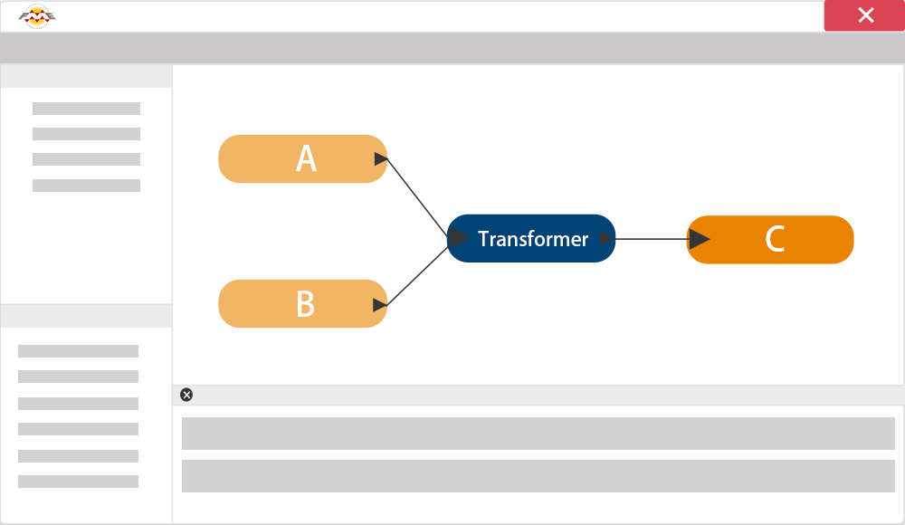

# What is FME?
**FME (the Feature Manipulation Engine)** is a data translation and transformation tool for solving problems of data interoperability. 

It is a way to integrate multiple data sources without the need for coding.

## Extract, Transform, and Load
FME is sometimes classed as an **ETL** application. ETL stands for Extract, Transform and Load. It is a data warehousing tool that extracts data from multiple sources (here A and B), transforms it to fit the users’ needs and loads it into a destination or data warehouse (C).

While most ETL tools process only tabular data, FME also has the geoprocessing capabilities required to handle spatial datasets.

For more general information on FME and what is can do for you, see [our web site](http://www.safe.com/how-it-works/).

