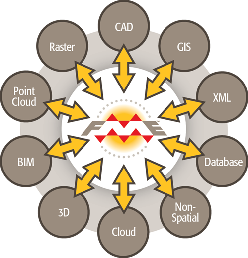

## How FME Works ##
At the heart of FME is an engine that supports an array of data types and data formats; from GIS and CAD to BIM and Point Cloud, via XML, Raster, databases, and many more.

### Rich Data Model ###
The capability to support so many data types is made possible by a rich data model that handles all possible geometry and attribute types. 

Most importantly, the data translation process is seamless to the user; FME automatically converts between data types as required, and automatically substitutes one attribute or geometry type for another where the destination format does not support it.

Check out our web site for a [full list of data formats](http://www.safe.com/fme/format-search/#!) supported in FME

---

<!--Person X Says Section-->

<table style="border-spacing: 0px">
<tr>
<td style="vertical-align:middle;background-color:darkorange;border: 2px solid darkorange">
<i class="fa fa-quote-left fa-lg fa-pull-left fa-fw" style="color:white;padding-right: 12px;vertical-align:text-top"></i>
Miss Vector says...
</td>
</tr>

<tr>
<td style="border: 1px solid darkorange">

Attention students! I'm Miss Vector, FME schoolteacher. I'm here to give you tests on what you have learned. I really hope you don't get these questions wrong!  
  Q) ETL is an acronym for...?
  1. Extra-Terrestrial Lifeform
 2. Extract, Transform, Load
 3. Express Toll Lane
 4. Eat, Transform, Love
  Q) FME can seamlessly translate between so many formats because it has...
  1. A sentient data dictionary
 2. A retro-encabulator
 3. A rich data model
 4. A core of unicorn hairs

</td>
</tr>
</table>