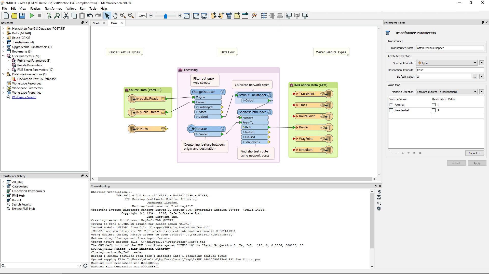
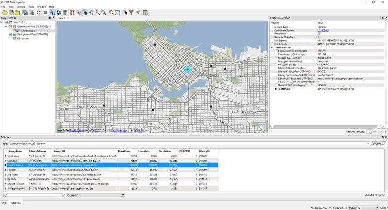

# FME Desktop #
The FME Desktop product is for data translations and transformations at the desktop level (as opposed to FME Server, which is an enterprise-level, web-based product). 

FME Desktop consists of a number of different tools and applications.

 
## FME Desktop Applications ##
The two key applications within FME Desktop are **FME Workbench** and the **FME Data Inspector**.

### FME Workbench ###
FME Workbench is the primary tool for defining data translations and data transformations. It has an intuitive point-and-click graphic interface to enable translations to be graphically described as a flow of data.

### FME Data Inspector ###
The FME Data Inspector is a tool for viewing data in any of the FME supported formats. It is used primarily for previewing data before translation or reviewing it after translation.

## FME Utilities ##
Besides Workbench and the Data Inspector, there are several other FME utilities.

### FME Help ###
A tool for browsing through the various help documents for FME.

### FME Quick Translator ###
A precursor to FME Workbench that is used only for quick translations requiring no data transformation.

### FME Integration Console ###
A tool for applying FME functionality to other GIS and CAD applications; commonly enabling use of datasets not normally supported by those applications.

### FME Licensing Assistant ###
An application for managing FME licensing.

## Other FME Desktop Components ##
Additional components are also included as part of FME Desktop (Professional Edition or higher).

### FME Command Line Engine ###
The FME Command Line Engine enables translations to be initiated at the command line level.

### FME Plug-In SDK ###
The FME Plug-In SDK allows developers to add formats and functionality to the FME core.

