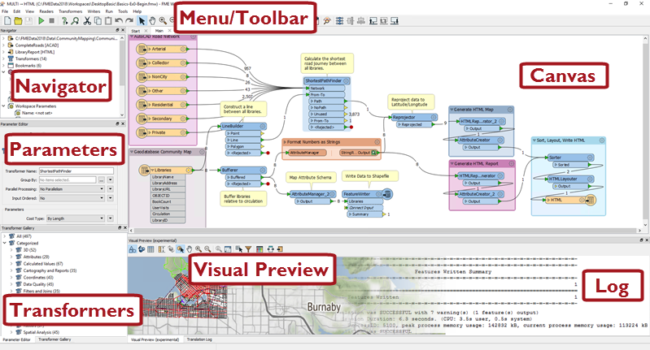
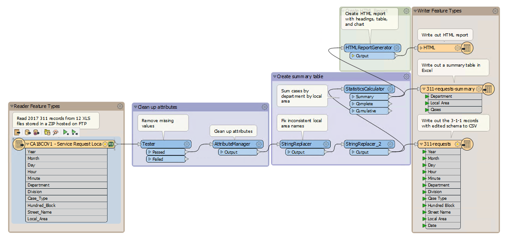
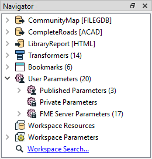
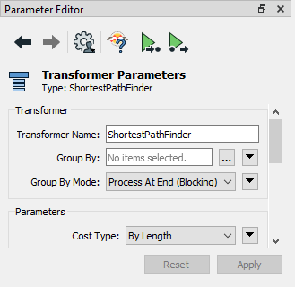

# Introduction to FME Workbench #
Let's take a closer look at FME Workbench, firstly how to start it. To start Workbench - besides double-clicking an fmw file - locate Workbench in the Windows start menu:

## Major Components of FME Workbench ##

The FME Workbench user interface has a number of major components:

### Canvas ###
As we've seen, the FME Workbench canvas is where to define a translation. It is the primary window within Workbench:

By default the workspace reads from left to right; data source on the left, transformation tools in the center, and data destination on the right. Connections between each item represent the flow of data and may branch in different directions, merge together, or both.

### Menu/Toolbar ###
The menubar and toolbar contain a number of tools: for example, tools for navigating around the Workbench canvas, controlling administrative tasks, and adding or removing readers/writers:

### Navigator ###
The Navigator window is a structured list of parameters that represent and control all of the components of a translation:

### Transformer Gallery ###
The transformer gallery is a tool for the location and selection of FME transformation tools.

The number of transformers (above, 484) will vary depending on the version of FME and any optional custom transformers installed:

### Translation Log ###
The translation log reports on translations and other actions. Information includes any warning or error messages, translation status, length of translation, and number of features processed:

<!--### Data Inspection (Visual Preview) Window ###
The Data Inspection window allows visual inspection of data without having to switch to the FME Data Inspection application:

 Map tiles by <a href="http://stamen.com">Stamen Design</a>, under <a href="http://creativecommons.org/licenses/by/3.0">CC-BY-3.0</a>. Data by <a href="http://openstreetmap.org">OpenStreetMap</a>, under <a href="http://creativecommons.org/licenses/by-sa/3.0">CC-BY-SA</a>.-->

<!--New Section--> 

<!--
<table style="border-spacing: 0px">
<tr>
<td style="vertical-align:middle;background-color:darkorange;border: 2px solid darkorange">
<i class="fa fa-bolt fa-lg fa-pull-left fa-fw" style="color:white;padding-right: 12px;vertical-align:text-top"></i>
NEW
</td>
</tr>

<tr>
<td style="border: 1px solid darkorange">

The Data Inspection window is new for FME2018. As we shall see, it is integrated with various objects on the canvas window to provide seamless data inspection. 

</td>
</tr>
</table>
-->

### Parameter Editor Window ###
The Parameter Editor window is for editing parameters for objects on the canvas window:

As the next section will show, you can open or close these windows at will, or rearrange them into any configuration that you like...

---

<!--Person X Says Section-->

<table style="border-spacing: 0px">
<tr>
<td style="vertical-align:middle;background-color:darkorange;border: 2px solid darkorange">
<i class="fa fa-quote-left fa-lg fa-pull-left fa-fw" style="color:white;padding-right: 12px;vertical-align:text-top"></i>
Miss Vector says...
</td>
</tr>

<tr>
<td style="border: 1px solid darkorange">

As we work through the course the questions will get harder. Still, these are pretty easy: 
  Which of the following applications is NOT a part of FME Desktop?
  <a href="http://52.73.3.37/fmedatastreaming/Manual/QAResponse2017.fmw?chapter=1&question=3&answer=1&DestDataset_TEXTLINE=C%3A%5CFMEOutput%5CQAResponse.html">1. FME Workbench</a>
 <a href="http://52.73.3.37/fmedatastreaming/Manual/QAResponse2017.fmw?chapter=1&question=3&answer=2&DestDataset_TEXTLINE=C%3A%5CFMEOutput%5CQAResponse.html">2. FME Integration Console</a>
 <a href="http://52.73.3.37/fmedatastreaming/Manual/QAResponse2017.fmw?chapter=1&question=3&answer=3&DestDataset_TEXTLINE=C%3A%5CFMEOutput%5CQAResponse.html">3. FME Server Console</a>
 <a href="http://52.73.3.37/fmedatastreaming/Manual/QAResponse2017.fmw?chapter=1&question=3&answer=4&DestDataset_TEXTLINE=C%3A%5CFMEOutput%5CQAResponse.html">4. FME Data Inspector</a>
  FME Workbench allows you to define flows of data in which way...
  <a href="http://52.73.3.37/fmedatastreaming/Manual/QAResponse2017.fmw?chapter=1&question=4&answer=1&DestDataset_TEXTLINE=C%3A%5CFMEOutput%5CQAResponse.html">1. Graphically</a>
 <a href="http://52.73.3.37/fmedatastreaming/Manual/QAResponse2017.fmw?chapter=1&question=4&answer=2&DestDataset_TEXTLINE=C%3A%5CFMEOutput%5CQAResponse.html">2. Telepathically</a>
 <a href="http://52.73.3.37/fmedatastreaming/Manual/QAResponse2017.fmw?chapter=1&question=4&answer=3&DestDataset_TEXTLINE=C%3A%5CFMEOutput%5CQAResponse.html">3. Problematically</a>
 <a href="http://52.73.3.37/fmedatastreaming/Manual/QAResponse2017.fmw?chapter=1&question=4&answer=4&DestDataset_TEXTLINE=C%3A%5CFMEOutput%5CQAResponse.html">4. By writing lots of code in C++ or Java</a>
 

</td>
</tr>
</table>