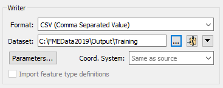

# Creating a Translation #

Workbench’s intuitive interface makes it easy to set up and run a simple format-to-format ('quick') translation.

## The Start Tab ##
The Start Tab in FME Workbench includes different ways to create or open a workspace. The simplest method is Generate Workspace:

## Generate Workspace Dialog ##
The Generate Workspace dialog condenses all the choices to be made into a single dialog box. It has fields for defining the format and location of both the data to be read, and the data to be written.

Red coloring in an FME dialog indicates mandatory fields. Users must enter data in these fields to continue. In most dialogs, the OK button is deactivated until the mandatory fields are complete.

### Format and Dataset Selection ###

A key requirement is the format of the source data. All format selection fields in FME are both a pull-down menu and a text entry field.

The text entry field allows you to type a format name directly. It has an 'intelli-complete' function that selects close matches as you type.

The drop-down list shows some of the most commonly used formats, so many favourite formats are instantly available:

Click 'More Formats' and a table opens showing all of the formats supported by FME in the **Reader and Writer Gallery**.

The source dataset is another key requirement. Dataset selection fields are a text entry field, but with a browse button to open an explorer-like dialog for file selection.

Similarly, the Writer format and dataset are defined in this dialog:

## Feature Types Dialog ##
Clicking OK on the Generate Workspace dialog causes FME to generate the defined workspace. However, whenever a source dataset contains multiple **feature types**, the user is first prompted to select which are to be translated.

This is achieved through the Select Feature Types dialog. Feature type is the FME term that describes a subset of records. Common alternatives for this term are *layer*, *table*, *sheet*, *feature class*, and *object class*. For example, each sheet in an Excel workbook, table in a database, or layer in a spatial data file is defined by a feature type in FME. Only feature types selected in the Select Feature Types dialog will be added to the workspace:

Here, for example, is a Select Feature Types dialog where the user has chosen to include all available layers in the workspace.
