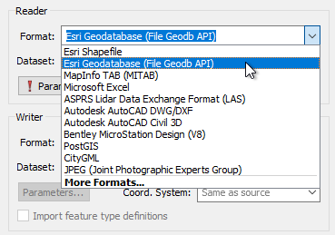

# Creating a Translation #

Workbench’s intuitive interface makes it easy to set up and run a simple format-to-format ('quick') translation.

## The Start Tab ##
The Start Tab in FME Workbench includes a section called "Getting Started." This section has links to the different ways in which a workspace can be created. The simplest method is Generate Workspace:

## Generate Workspace Dialog ##
The Generate Workspace dialog condenses all the choices to be made into a single dialog box. It has fields for defining the format and location of both the data to be read, and the data to be written.

### Format Selection ###

All format selection fields in FME are both a pull-down menu and a text entry field. 

The text entry field allows you to type a format name directly. It has an 'intelli-complete' function that selects close matches as you type.

The drop-down list shows the last ten formats used, so favourite formats are instantly available:

Format selection can also be made from a table showing ALL of the formats supported by FME. To access this table, select 'More Formats...' from the foot of the drop-down formats list.

Dataset selection fields are a text entry field, but with a browse button to open an explorer-like dialog.

Red coloring in an FME dialog indicates mandatory fields. Users must enter data in these fields to continue. In most dialogs the OK button is de-activated until the mandatory fields are complete.

---

<!--Person X Says Section-->

<table style="border-spacing: 0px">
<tr>
<td style="vertical-align:middle;background-color:darkorange;border: 2px solid darkorange">
<i class="fa fa-quote-left fa-lg fa-pull-left fa-fw" style="color:white;padding-right: 12px;vertical-align:text-top"></i>
Miss Vector says...
</td>
</tr>

<tr>
<td style="border: 1px solid darkorange">

Here's a question you can't answer with 'a', 'b', 'c', or 'd'! In the Generate Workspace dialog, why might it be useful to set the data format before browsing for the source data?
  Try browsing for a dataset before setting the format type and see if you can detect the difference. <a href="http://52.73.3.37/fmedatastreaming/Manual/QAResponse2017.fmw?chapter=1&question=7&answer=1&DestDataset_TEXTLINE=C%3A%5CFMEOutput%5CQAResponse.html">Did you get it yet?</a>

</td>
</tr>
</table>

---

## Feature Types Dialog ##
Clicking OK on the Generate Workspace dialog causes FME to generate the defined workspace. However, whenever a source dataset contains multiple layers the user is first prompted to select which are to be translated.

This is achieved through the Select Feature Types dialog. In FME *Feature Type* is another term for *layer*. Only selected layers show in the workspace.

Here, for example, is a Select Feature Types dialog where the user has chosen to include all available layers in the workspace.
