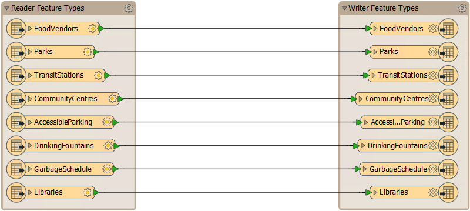

## The New Workspace ##
A new workspace reads from left to right, from the source (Reader) layers, through to the destination (Writer) layers. Arrows denote the direction of data flow:

In the above screenshot, eight layers are being read from one format and written to another.





In most cases FME uses the terms 'Reader' and 'Writer' instead of 'Source’ and ‘Destination.' So a Reader reads datasets and a Writer writes datasets, in terms analogous to source/destination and input/output.



## Saving the Workspace ##
Workspaces can be saved to a file so that they can be reused at a later date. The save button on the toolbar is one way to do this:

There are also menu options to do the same thing, in this case, File &gt; Save (shortcut = Ctrl+S) or File &gt; Save As. The default file extension is .fmw.



There are several intuitive, but less obvious, features of the FME Workbench interface.
  For example, select File &gt; Open Recent on the menubar to reveal a list of previously used workspaces. This list can show up to a huge 15 entries.


