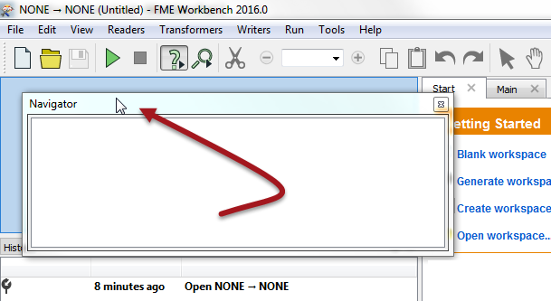

# Window Control #
All windows in Workbench can be detached from their default position and deposited in a custom location. To do this simply click on the frame of the window and drag it into a new position. 

 If a window is dropped on top of an existing window, then the two will become tabbed.

If a window is dropped beside an existing window (or between two existing windows), then they will become stacked.

In the above screenshot the user is dropping the Navigator into position on the left-hand side of Workbench, stacked on top of the History window.

<!--Person X Says Section-->

---

<table style="border-spacing: 0px">
<tr>
<td style="vertical-align:middle;background-color:darkorange;border: 2px solid darkorange">
<i class="fa fa-quote-left fa-lg fa-pull-left fa-fw" style="color:white;padding-right: 12px;vertical-align:text-top"></i>
FireFighter Mapp says...
</td>
</tr>

<tr>
<td style="border: 1px solid darkorange">

Here's a hot tip for you. Don't feel put out by a lack of canvas space. Pressing F11 instantly dispatches the lesser-used windows to one side and expands the canvas window to an alarming size!

</td>
</tr>
</table>

---

<!--Person X Says Section-->

<table style="border-spacing: 0px">
<tr>
<td style="vertical-align:middle;background-color:darkorange;border: 2px solid darkorange">
<i class="fa fa-quote-left fa-lg fa-pull-left fa-fw" style="color:white;padding-right: 12px;vertical-align:text-top"></i>
Miss Vector says...
</td>
</tr>

<tr>
<td style="border: 1px solid darkorange">

Switch over to FME Workbench and experiment with the windows (look under the View menu) to answer these questions.
  Which of these is a window in FME Workbench?
  1. The Maths Window
 2. the Geography Window
 3. The English Literature Window
 4. The History Window
  Which of these is NOT an arrangement of Windows in FME Workbench?
  1. Stacked
 2. Floating
 3. Double-Glazed
 4. Tabbed

</td>
</tr>
</table>
