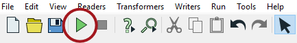
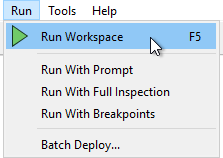

## Running a Workspace ##

The green arrow (or 'play' button) on the Workbench toolbar starts a translation:

Alternatively, look under Run on the menubar:

The same toolbar options appear on both the menubar and toolbar. Notice the shortcut option F5 can be used instead:





The action of the Run button can be modified by the dropdown on the button, including the ability to only run sections of your workspace (Run Selected), prompt the user for input (Prompt for User Parameters), the ability to cache intermediate data (Enable Feature Caching) and the ability to run with breakpoints for debugging (Stop at Breakpoints). We'll cover some of them later in the training.



## Workspace Results ##
After running a workspace, related information and statistics are found in the translation log, which is displayed in the Workbench log window.

The translation log reveals whether the translation succeeded or failed, how many features were read from the source and written to the destination, and how long it took to perform the translation.

In this example, the log file reveals that 350 features were read (from an Esri Geodatabase) and written out (to a GML dataset).

The overall process was a success, with zero warnings. The elapsed time for the translation was 2.1 seconds.
