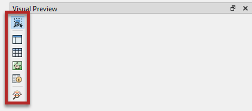

# Data Inspection Tools

FME data inspection tools let you view data in any supported format. They are used primarily to preview data before translation or to verify it after translation. You can use them to set up and debug workspaces by inspecting data *during* the translation.

FME data inspection tools are not designed to be full-featured spreadsheet, database, or mapping applications. They have no analysis or editing functionality, and the tools for symbology modification or printing are intended for data validation rather than producing output.

## Visual Preview

Visual Preview is an embedded version of FME Data Inspector that displays features in a Workbench window. Many  - but not all - of the features available in the stand-alone Data Inspector application are available in Visual Preview. Visual Preview lets you inspect your data directly in Workbench as you build your workspace:

 Map tiles by <a href="https://stamen.com">Stamen Design</a>, under <a href="https://creativecommons.org/licenses/by/3.0">CC-BY-3.0</a>. Data by <a href="http://openstreetmap.org">OpenStreetMap</a>, under <a href="http://creativecommons.org/licenses/by-sa/3.0">CC-BY-SA</a>.

You can view features in Visual Preview in these ways:

Right-click on a feature type in the Navigator or Workbench Canvas, and select View Source Data:

On the canvas, click the View Source Data icon on the mini-toolbar over a feature type or some transformers:

Run a workspace with feature caching enabled and then select cached objects (we'll cover feature caching in the next section):

Drag and drop data files onto the pane:

In this module, we will primarily use Visual Preview in combination with feature caching, as explained in the next section.

### Major Components of Visual Preview

The Visual Preview pane has options for toggling on and off several other windows to provide different ways of inspecting your data. You can do so using the buttons on the left side of the Visual Preview pane:

#### Options

The **Toggle Automatic Inspection on Selection** button  lets you decide if data should automatically be displayed in Visual Preview when a cached object is selected. It is on by default.

The **Open in Data Inspector** button  opens the displayed data in Data Inspector.

#### Graphics Window

The **Toggle Graphics View** button  controls the Graphics window, the area where spatial data is displayed:

 Map tiles by <a href="https://stamen.com">Stamen Design</a>, under <a href="https://creativecommons.org/licenses/by/3.0">CC-BY-3.0</a>. Data by <a href="http://openstreetmap.org">OpenStreetMap</a>, under <a href="http://creativecommons.org/licenses/by-sa/3.0">CC-BY-SA</a>.

##### Toolbar

The Graphics window contains a toolbar. Some buttons are for navigating around the View window, some control selecting features, and others are for particular functions such as filtering data:

#### Display Control Window

The **Toggle Display Control** button  controls the Display Control window, which shows a list of the open datasets and their feature types. Tools here let users turn these on or off in the display, alter their symbology, and adjust the display order:

#### Table View Window

The **Toggle Table View** button  controls the Table View, a spreadsheet-like view of a dataset, which includes all of the features and all of the attributes, with a separate tab for each feature type:

#### Feature Information Window

The **Toggle Feature Information window** button  controls the Feature Information window. When you query a feature in the View window, the Information window shows information about that feature. This information includes the feature’s feature type, attributes, coordinate system, and details about its geometry:

## FME Data Inspector

FME Data Inspector is a standalone application for inspecting data. It has similar functionality to Visual Preview, but comes with a few more features.

### Starting FME Data Inspector

To start the Data Inspector, locate it in the Windows start menu:

### Major Components of FME Data Inspector

When FME Data Inspector opens a dataset, it looks something like this:

 Map tiles by <a href="https://stamen.com">Stamen Design</a>, under <a href="https://creativecommons.org/licenses/by/3.0">CC-BY-3.0</a>. Data by <a href="http://openstreetmap.org">OpenStreetMap</a>, under <a href="http://creativecommons.org/licenses/by-sa/3.0">CC-BY-SA</a>.

These components function the same as Visual Preview, with the following differences:
- There is a menu bar.
- The Graphics window is called the View window and can have multiple tabs called Views, each displaying different datasets.
- You can open data (File > Open Dataset), which opens it in a new View, or you can add data (File > Add Dataset), which adds data to the open View.
- A few additional tools are available, including [Mark Location](http://docs.safe.com/fme/2019.0/html/FME_Desktop_Documentation/FME_DataInspector/DataInspector/Marking-Locations.htm) and [Measure Distances](http://docs.safe.com/fme/2019.0/html/FME_Desktop_Documentation/FME_DataInspector/DataInspector/Using_the_Measuring_Tool.htm).
