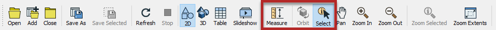
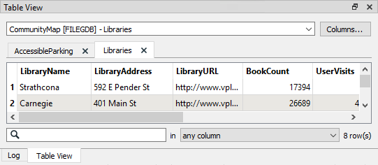

## Inspecting Data ##

The FME Data Inspector includes several inspection tools, but two are particularly important:

- Select individual feature(s)
- Measure a distance within a View window

The select tool button is like a toggle. By default it is active when you start the FME Data Inspector; if you click it again - or select a windowing tool - you turn the select tool off.

The results of a selected feature are shown in the Feature Information window.

### Feature Information Window ###
The upper part of this window reports on general information about the feature; which feature type (layer/table) it belongs to. If the feature is spatial, it will also report which coordinate system it is in, whether it is two- or three-dimensional, and how many vertices it possesses.

The middle part reports the attributes associated with the feature, including user attributes and format attributes (for example *fme_type*).

The lower part reports the geometry of the feature. It includes the geometry type and a list of the coordinates that go to make up the feature.

### Table View Window ###
Also available is a window called the Table View.

The table view is a way to inspect data in a tabular, spreadsheet-like, layout. Although it does not have the same depth of information as shown by the Information Window, the Table View is particularly useful for inspecting the attribute values of multiple features simultaneously.

You can switch back and forth between feature types in the Table View by clicking the dropdown menu at the top of Table View.

---

<!--Tip Section-->

<table style="border-spacing: 0px">
<tr>
<td style="vertical-align:middle;background-color:darkorange;border: 2px solid darkorange">
<i class="fa fa-info-circle fa-lg fa-pull-left fa-fw" style="color:white;padding-right: 12px;vertical-align:text-top"></i>
TIP
</td>
</tr>

<tr>
<td style="border: 1px solid darkorange">

To improve performance, tables are not all displayed automatically, only when selected from the drop-down list, or when queried in the current view window.

</td>
</tr>
</table>
