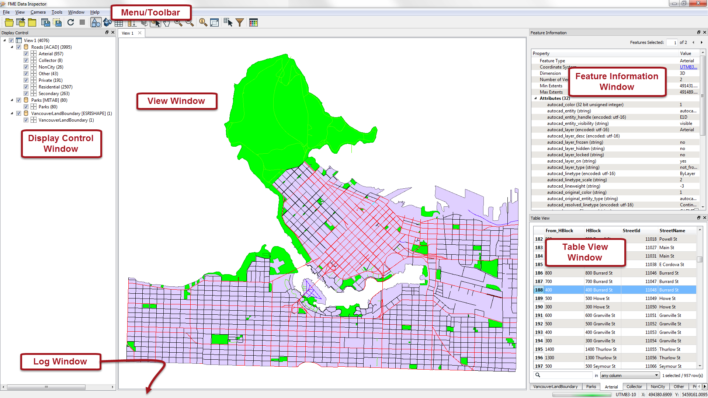
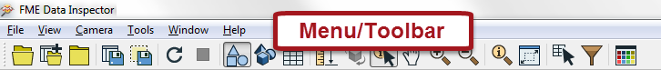
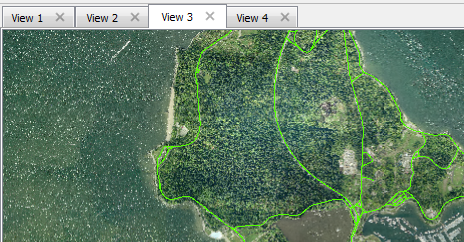
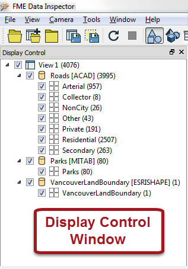
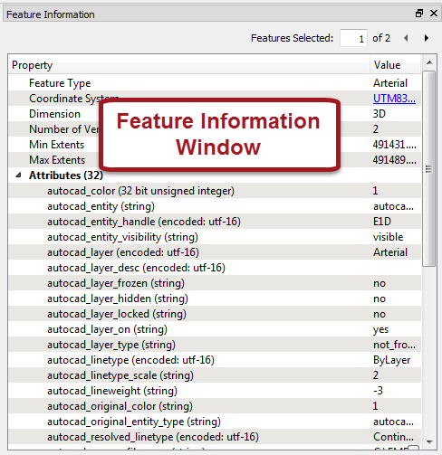
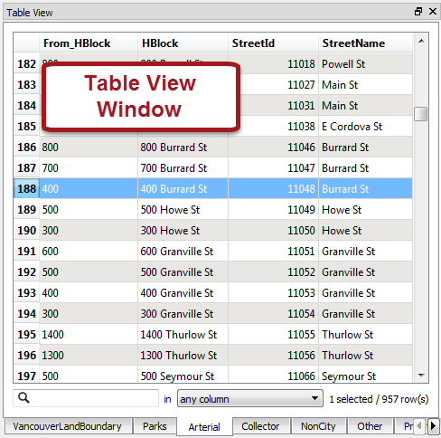

# Major Components of the FME Data Inspector #

When the FME Data Inspector is started, and a dataset is opened, it looks something like this:

## Menu bar and Toolbar ##
The menu bar and toolbar contain a number of tools. Some are for navigating around the View window, some control administrative tasks such as opening or saving a dataset, and others are for special functionality such as selective filtering of data or the creation of dynamic attributes.

## View Window ##
The View window is the spatial display area of the FME Data Inspector. Multiple views of different datasets may be opened at any one time.

## Display Control Window ##
The Display Control window shows a list of the open datasets and their feature types. Tools here let users turn these on or off in the display, alter their symbology, and adjust the display order.

## Feature Information Window ##
When users query a feature in the View window, information about that feature is shown in the Information window. This information includes the feature’s feature type, attributes (both user and format attributes), coordinate system and details about its geometry.

## Table View Window ##
The Table View window is a spreadsheet-like view of a dataset and includes all of the features and all of the attributes, with a separate tab for each feature type (layer).

## Log Window ##
The Log window (hidden in above screenshot) reports information relating to the reading and look of a dataset that can be used to confirm whether data has been read correctly. Some functions on the toolbar also generate messages in the Log window.
