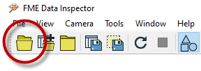
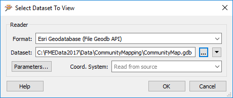
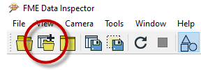
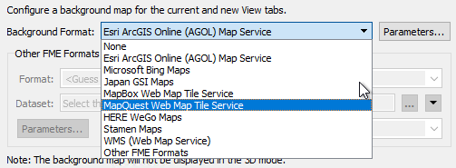
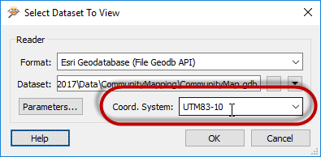

# Using the FME Data Inspector #

With the FME Data Inspector it’s easy to open and view any number of datasets and to query features within them.

 
## Viewing Data ##
The FME Data Inspector provides two methods for viewing data: opening or adding. Opening a dataset opens a new view window for it to be displayed in. Adding a dataset displays the data in the existing view window; this way multiple datasets can be viewed simultaneously.

### Opening a Dataset ###
Datasets can be opened in the FME Data Inspector in a number of ways.

- Select File > Open Dataset from the menu bar
- Select the toolbar button Open Dataset.
- Drag and drop a file onto any window (except the View window)
- Open from within Workbench

Opening data from within FME Workbench is achieved by simply right-clicking on a canvas feature type (either source or destination) and choosing the option ‘Inspect'.

All of these methods cause a dialog to open in the FME Data Inspector in which to define the dataset to view.

### Adding a Dataset ###
Opening a dataset causes a new View tab to be created and the data displayed. To open a dataset within an existing view tab requires use of tools to add a dataset.

- Selecting File > Add Dataset from the menu bar
- Selecting the toolbar button Add Dataset
- Dragging and Dropping a file onto the view window

### Windowing Tools ###
Once data has been opened in the FME Data Inspector, there are a number of tools available for altering the view.

- Pan
- Zoom In
- Zoom Out
- Zoom to a selected feature
- Zoom to the full extent of the data

---

### Background Maps ###
The ability to view maps (or other imagery) as a backdrop to your spatial data is activated by a tool under Tools > FME Options on the menubar.

The background map dialog lets the user select an existing dataset (of any FME-supported format) to use as a backdrop, like so:

It's also possible to use a number of different web services that supply mapping on demand. Some of these - such as ArcGIS Online - do require an existing account:

---

<!--Person X Says Section-->

<table style="border-spacing: 0px">
<tr>
<td style="vertical-align:middle;background-color:darkorange;border: 2px solid darkorange">
<i class="fa fa-quote-left fa-lg fa-pull-left fa-fw" style="color:white;padding-right: 12px;vertical-align:text-top"></i>
Police Chief Webb-Mapp says...
</td>
</tr>

<tr>
<td style="border: 1px solid darkorange">

When I'm investigating - sorry, inspecting - source data I know it must be referenced against a valid coordinate system for background data to be displayed. If the coordinate system is not recorded in the dataset itself, I can enter it into a field when opening the dataset
  
  I've also deduced that it doesn't matter what coordinate system the data is referenced against; FME will automatically convert it to whatever system is being used by the background map.

</td>
</tr>
</table>

---