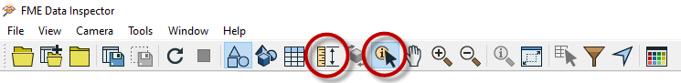
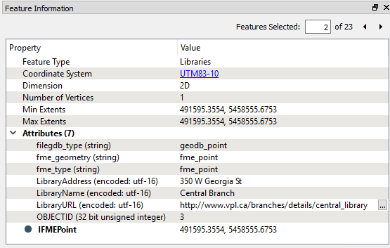
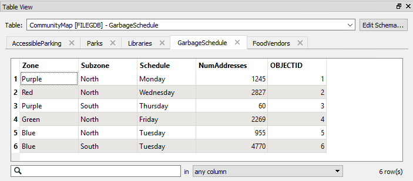

## Inspecting Data ##
THE FME Data Inspector includes several querying tools, but in particular:

- Query individual feature(s)
- Measure a distance within a View window

The query tool button is like a toggle. By default it is active when you start the FME Data Inspector; if you click it again - or select a windowing tool - you turn the query tool off. 

The results of a feature query are shown in the Feature Information window.

### Feature Information Window ###
The upper part reports on general information about the feature; which feature type (layer) it belongs to, which coordinate system it is in, whether it is two- or three-dimensional, and how many vertices it possesses.

The middle part reports the attributes associated with the feature. This includes user attributes and format attributes (for example fme_type).

The lower part reports the geometry of the feature. It includes the geometry type and a list of the coordinates that go to make up the feature.

### Table View Window ###
Also available is a window called the Table View.

The table view is a way to inspect data in a tabular, spreadsheet-like, layout. Although it does not have the same depth of information shown by the Information Window, the Table View is particularly useful for inspecting the attribute values of multiple features simultaneously.

---

<!--New Section--> 

<table style="border-spacing: 0px">
<tr>
<td style="vertical-align:middle;background-color:darkorange;border: 2px solid darkorange">
<i class="fa fa-bolt fa-lg fa-pull-left fa-fw" style="color:white;padding-right: 12px;vertical-align:text-top"></i>
NEW
</td>
</tr>

<tr>
<td style="border: 1px solid darkorange">

In FME2017 the Table View Window changed slightly. In previous versions, all tables were displayed automatically. Now, to improve performance, tables are only displayed when selected from the drop-down list.

</td>
</tr>
</table>

---

<!--Person X Says Section-->

<table style="border-spacing: 0px">
<tr>
<td style="vertical-align:middle;background-color:darkorange;border: 2px solid darkorange">
<i class="fa fa-quote-left fa-lg fa-pull-left fa-fw" style="color:white;padding-right: 12px;vertical-align:text-top"></i>
Miss Vector says...
</td>
</tr>

<tr>
<td style="border: 1px solid darkorange">

You'll need to have the FME Data Inspector started to answer this question.
  Open a dataset and right-click on records and column-headers in the Table View window. Which of the following is NOT an available option(s): 
  <a href="http://52.73.3.37/fmedatastreaming/Manual/QAResponseDotZero.fmw?chapter=1&question=11&answer=1&DestDataset_TEXTLINE=C%3A%5CFMEOutput%5CQAResponse.html">1. Sort (Alphabetical or Numeric)</a>
 <a href="http://52.73.3.37/fmedatastreaming/Manual/QAResponseDotZero.fmw?chapter=1&question=11&answer=2&DestDataset_TEXTLINE=C%3A%5CFMEOutput%5CQAResponse.html">2. Inspect Value</a>
 <a href="http://52.73.3.37/fmedatastreaming/Manual/QAResponseDotZero.fmw?chapter=1&question=11&answer=3&DestDataset_TEXTLINE=C%3A%5CFMEOutput%5CQAResponse.html">3. Cut/Copy/Paste</a>
 <a href="http://52.73.3.37/fmedatastreaming/Manual/QAResponseDotZero.fmw?chapter=1&question=11&answer=4&DestDataset_TEXTLINE=C%3A%5CFMEOutput%5CQAResponse.html">4. Save Selected Data As</a>

</td>
</tr>
</table>