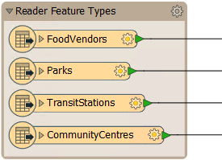
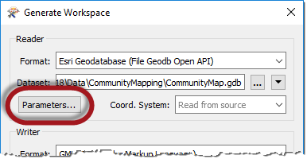

# Reader Parameters ##
As we know, a workspace contains a reader to read a dataset, and each layer in that dataset is shown in the workspace canvas: 

To control how that reader operates requires the use of **reader parameters**.

### Finding Reader Parameters ###
Reader parameters can be located - and set - by clicking Parameters when a new workspace is being generated:

They can also be found in the Navigator window in Workbench:

Because parameters refer to specific components and characteristics of the related format, readers of different formats have a different set of control parameters.

### Setting Reader Parameters ###
To edit a parameter in the Navigator window, double-click on any of the parameters. This opens up a dialog where the parameter’s value may be set:

---

<!--Person X Says Section-->

<table style="border-spacing: 0px">
<tr>
<td style="vertical-align:middle;background-color:darkorange;border: 2px solid darkorange">
<i class="fa fa-quote-left fa-lg fa-pull-left fa-fw" style="color:white;padding-right: 12px;vertical-align:text-top"></i>
Dr. Workbench says...
</td>
</tr>

<tr>
<td style="border: 1px solid darkorange">

Reader parameters control all feature types in the dataset. Think of it like brewing a pot of coffee. The strength control on the coffee machine affects all the cups that are poured. 

</td>
</tr>
</table>