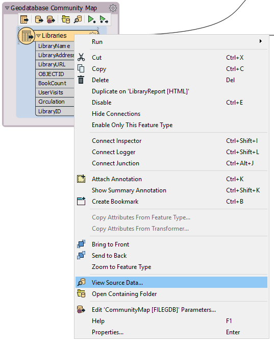
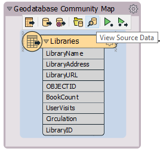

## Visual Preview

Visual Preview is an embedded version of FME Data Inspector that displays features in a Workbench window. Many  - but not all - of the features available in the stand-alone Data Inspector application are available in Visual Preview. In this course, we will inspect data primarily using Visual Preview and feature caching.

Visual Preview lets you inspect your data directly in Workbench as you build your workspace:

 Map tiles by <a href="https://stamen.com">Stamen Design</a>, under <a href="https://creativecommons.org/licenses/by/3.0">CC-BY-3.0</a>. Data by <a href="http://openstreetmap.org">OpenStreetMap</a>, under <a href="http://creativecommons.org/licenses/by-sa/3.0">CC-BY-SA</a>.

---

<!--New Section-->

<table style="border-spacing: 0px">
<tr>
<td style="vertical-align:middle;background-color:darkorange;border: 2px solid darkorange">
<i class="fa fa-bolt fa-lg fa-pull-left fa-fw" style="color:white;padding-right: 12px;vertical-align:text-top"></i>
NEW
</td>
</tr>

<tr>
<td style="border: 1px solid darkorange">

Visual Preview is a new feature for FME 2019.0. 
If you would prefer not to use it, you can disable it under FME Options > Workbench > Data Inspection > Inspect with Data Inspector when Visual Preview window closed.

</td>
</tr>
</table>

---

### Viewing Data in Visual Preview

You can view features in Visual Preview in these ways:

Right-click on a feature type in the Navigator or Workbench Canvas, and select View Source Data:

On the canvas, click the View Source Data icon on the mini-toolbar over a feature type or some transformers:

Run a workspace with feature caching enabled and then select cached objects:

Drag and drop data files onto the pane:

### Major Components of Visual Preview

The Visual Preview pane has options for toggling on and off several other windows to provide different ways of inspecting your data. You can do so using the buttons on the left side of the Visual Preview pane:

#### Options

The **Toggle Automatic Inspection on Selection** button  lets you decide if data should automatically be displayed in Visual Preview when a cached object is selected. It is on by default.

The **Open in Data Inspector** button  opens the displayed data in Data Inspector.

#### Windows

The remaining buttons on the Visual Preview toolbar all toggle windows on and off. These windows replicate their function in Data Inspector.

The **Toggle Graphics View** button  controls the Graphics window, the area where spatial data is displayed.

The **Toggle Display Control** button  controls the Display Control window.

The **Toggle Table View** button  controls the Table View.

The **Toggle Feature Information window** button  controls the Feature Information window. Just like in Data Inspector, when you select a feature in the Graphics or Table View window, the Feature Information window shows information about that feature.
