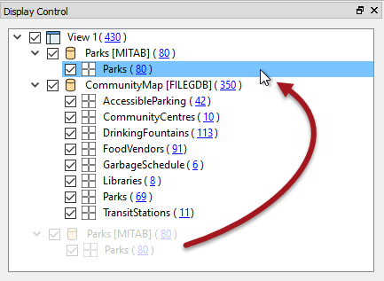
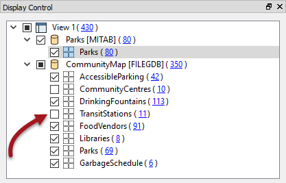
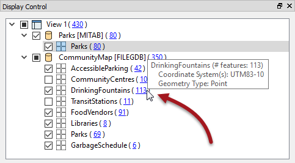
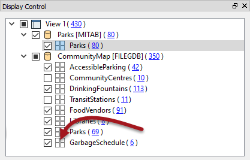
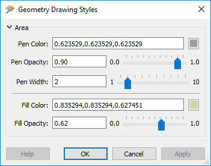

## Data Inspector Display Control ##

The FME Data Inspector has a number of controls to assist in showing the data in an orderly manner.

 
### Display Control Window ###
Management of feature display order is carried out in the Display Control window.

Each dataset and feature type can be dragged above any other to promote its display order in the View window.

Feature Types can only be ordered within their container dataset.

For example, "Libraries" can be promoted above "GarbageSchedule" in the display, but they cannot by themselves be promoted above the MapInfo Parks dataset.

---

### Display Status ###
Each level of the Display Control window has a checkbox to turn data on and off at that level.

You can choose to turn off individual layers or an entire dataset at once.

---

### Feature Counts ###

Each Feature Type in the Display Control window is tagged with the number of features it contains, in parentheses after the feature type name. So in the previous image we can see that there are 113 drinking fountains (or 113 features called DrinkingFountains) in the city of Vancouver.

<!--New Section--> 

<table style="border-spacing: 0px">
<tr>
<td style="vertical-align:middle;background-color:darkorange;border: 2px solid darkorange">
<i class="fa fa-bolt fa-lg fa-pull-left fa-fw" style="color:white;padding-right: 12px;vertical-align:text-top"></i>
NEW
</td>
</tr>

<tr>
<td style="border: 1px solid darkorange">

FME2017 introduces clickable feature counts. Clicking a feature count selects all of those features for display in the Feature Information and Table View windows, and also activates the tool File > Save Selected Data As.
  Also notice that hovering over an entry in the list now causes an informational tooltip to appear:
  

</td>
</tr>
</table>

---

### Style ###

Each feature type can be assigned a different color or style that applies to its geometries. To access this functionality click on the style icon for that feature type in the Display Control window:

The Drawing Style dialog allows you to set all manner of symbology for a feature. That includes feature color (and degree of transparency), point icon/symbol, point size, line thickness, etc:

Notice that the dialog only displays symbology options for the type of geometry available. Here it is for a polygon feature. Other geometry types display different options. 