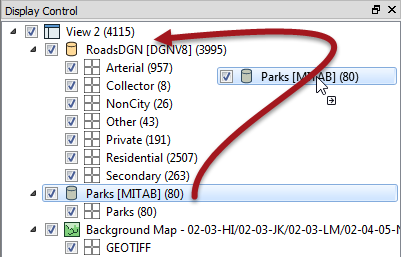
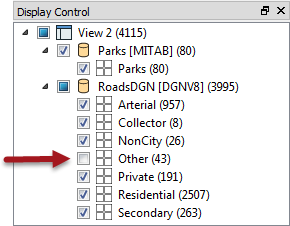
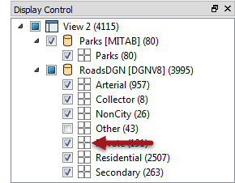
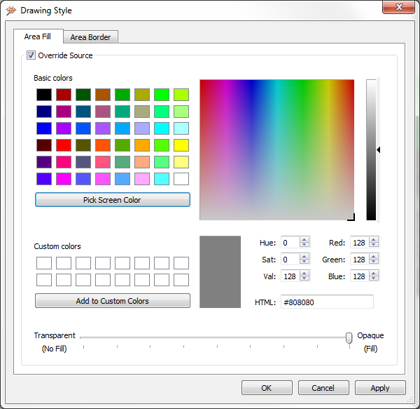
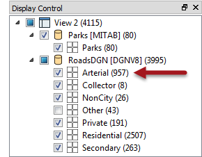
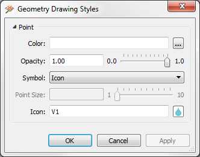

## Data Inspector Display Control ##

The FME Data Inspector has a number of controls to assist in showing the data in an orderly manner.

 
### Display Control Window ###
Management of feature display order is carried out in the Display Control window.

Each dataset and feature type can be dragged above any other to promote its display order in the View window.

Feature Types can only be ordered within their container dataset.

For example, "Private" roads cannot be promoted above "Parks" in the display, without the entire Roads dataset being promoted above Parks.

---

### Display Status ###
Each level of the Display Control window has a checkbox to turn data on and off at that level.

You can choose to turn off individual layers or an entire dataset at once.

---

### Style ###

Each feature type can be assigned a different color or style that applies to its geometries. To access this functionality click on the style icon for that feature type in the Display Control window:

The Drawing Style dialog allows you to set the color of a feature and its degree of transparency. The exact settings available depend upon the type of geometry being set; for example a polygon feature will have settings for both fill and border:

Each Feature Type in the Display Control window is tagged with the number of features it contains, in parentheses after the feature type name.
 

 
Thus we can see that there are 957 arterial road links in the city of Vancouver.

---

<!--Updated Section--> 

<table style="border-spacing: 0px">
<tr>
<td style="vertical-align:middle;background-color:darkorange;border: 2px solid darkorange">
<i class="fa fa-bolt fa-lg fa-pull-left fa-fw" style="color:white;padding-right: 12px;vertical-align:text-top"></i>
.1 UPDATE
</td>
</tr>

<tr>
<td style="border: 1px solid darkorange">

FME2016.1 introduces a number of styling improvements for the Data Inspector.
  All style dialogs have been revised and updated with a new look and feel.
 New options include the ability to resize point features and even replace them with a specific icon
 Raster datasets - including the background map - can have an opacity set to make them semi-transparent.
  

</td>
</tr>
</table>

---
 
