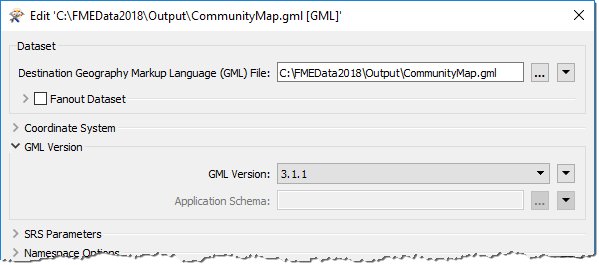

## Writer Parameters ##
Like readers, we know a workspace contains a writer to write a dataset, and each layer to be written is shown in the workspace canvas: 

To control how that writer operates requires the use of **writer parameters**.

### Finding Writer Parameters ###
Writer parameters can be located - and set - by clicking Parameters when a new workspace is being generated:

They too can also be found in the Navigator window in Workbench:

Because parameters refer to specific components and characteristics of the related format, writers of different formats have a different set of control parameters.

### Setting Writer Parameters ###
To edit a parameter in the Navigator window, double-click on any of the parameters. This opens up a dialog where the parameter’s value may be set:

---

<!--Person X Says Section-->

<table style="border-spacing: 0px">
<tr>
<td style="vertical-align:middle;background-color:darkorange;border: 2px solid darkorange">
<i class="fa fa-quote-left fa-lg fa-pull-left fa-fw" style="color:white;padding-right: 12px;vertical-align:text-top"></i>
Dr. Workbench says...
</td>
</tr>

<tr>
<td style="border: 1px solid darkorange">

Like readers, writer parameters control all feature types in the dataset. For example, in the above screenshot, all feature types will be version 3.1.1.
  But each reader and writer feature type does have its own settings (in the same way that each cup of coffee can be adjusted with cream and sugar). We'll find out about that in the next chapter. 

</td>
</tr>
</table>