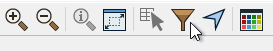
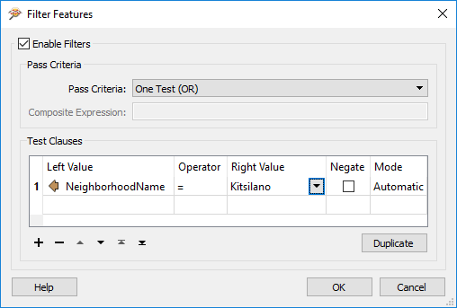
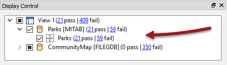

## Miscellaneous Data Inspector Functionality ##

The FME Data Inspector has a number of miscellaneous functions that help users view background maps, filter data, and even translate data to a different format!

### Background Maps ###
The ability to view maps (or other imagery) as a backdrop to your spatial data is activated by a tool under Tools > FME Options on the menubar.

The background map dialog lets the user select an existing dataset (of any FME-supported format) to use as a backdrop, like so:

It's also possible to use a number of different web services that supply mapping on demand. Some of these - such as ArcGIS Online - do require an existing account:

<!--Person X Says Section-->

<table style="border-spacing: 0px">
<tr>
<td style="vertical-align:middle;background-color:darkorange;border: 2px solid darkorange">
<i class="fa fa-quote-left fa-lg fa-pull-left fa-fw" style="color:white;padding-right: 12px;vertical-align:text-top"></i>
Police Chief Webb-Mapp says...
</td>
</tr>

<tr>
<td style="border: 1px solid darkorange">

When I'm investigating - sorry, inspecting - source data I know it must be referenced against a valid coordinate system for background data to be displayed. If the coordinate system is not recorded in the dataset itself, I can enter it into a field when opening the dataset
  
  I've also deduced that it doesn't matter what coordinate system the data is referenced against; FME will automatically convert it to whatever system is being used by the background map.

</td>
</tr>
</table>

---

### Data Filtering ###
Data in the View window can be filtered by a set of user-defined criteria to show only the features that are required at the time. This functionality is activated by Tools > Filter Features on the menubar, or the filter icon on the toolbar:

The Filter Features dialog allows a whole series of test clauses to be set up, using a number of operators to test the values of source data attributes. For example, here the user is filtering (keeping displayed) all features that are located in the neighborhood of Kitsilano.

<!--New Section--> 

<table style="border-spacing: 0px">
<tr>
<td style="vertical-align:middle;background-color:darkorange;border: 2px solid darkorange">
<i class="fa fa-bolt fa-lg fa-pull-left fa-fw" style="color:white;padding-right: 12px;vertical-align:text-top"></i>
NEW
</td>
</tr>

<tr>
<td style="border: 1px solid darkorange">

In FME2017 the feature counts on the Display Control window now update to reflect the status of any filter that is applied, showing how many features pass the filter test and how many fail:

  

</td>
</tr>
</table>

---

### Save Tools ###
The FME Data Inspector save tool lets you save whatever data is currently being displayed in the view window. The data can be saved in any FME-supported format of your choice.

Simply select File > Save Data As to open the prompt for saving data.

File > Save Selected Data As saves only the data that is currently selected in the view or table view windows.

