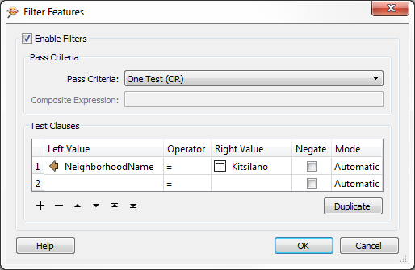

## Miscellaneous Data Inspector Functionality ##

The FME Data Inspector has a number of miscellaneous functions that help users navigate through data, investigate data, and even translate data to a different format!

### Shift and Ctrl Key Functions ###
Press the Shift key on the keyboard and it will activate the zoom-in tool in the Inspector.

Press the Ctrl key and it will activate the zoom-out tool. Release the key to revert to the previous tool.

This functionality allows users to quickly move between query and navigation modes at the press of a key, so there’s no need to click between query and navigation tools on the menubar or toolbar.

### Save Tools ###
The FME Data Inspector save tool lets you save whatever data is currently being displayed in the view window. The data can be saved in any FME-supported format of your choice.

Simply select File > Save Data As to open the prompt for saving data.

File > Save Selected Data As saves only the data that is currently selected in the view or table view windows.

### Data Filtering ###
Data in the View window can be filtered by a set of user-defined criteria to show only the features that are required at the time. This functionality is activated by Tools > Filter Features on the menubar.

The Filter Features dialog allows a whole series of test clauses to be set up, using a number of operators to test the values of source data attributes. For example, here the user is filtering (keeping displayed) all features that are located in the neighborhood of Kitsilano.

