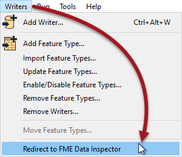

# Translation Previews #

A key ability of FME is communication of data between Workbench and the FME Data Inspector.

 
## Redirect to FME Data Inspector ##
In some cases it’s desirable to inspect output data, but undesirable to actually have to write the data to do so. In other words, you want to preview what the output of a translation will be.

For example, it would be useful to preview the results of a workspace that updates a spatial database. That way mistakes can be detected before writing to the database.

The Workbench tool to do this is the menu option Writers > Redirect to FME Data Inspector:

When this setting is applied, the output from a translation is redirected away from the specified output and sent directly to FME Data Inspector instead.

This setting is a toggle, which means that each subsequent selection alternately turns the setting on and off.

---

<!--Warning Section--> 

<table style="border-spacing: 0px">
<tr>
<td style="vertical-align:middle;background-color:darkorange;border: 2px solid darkorange">
<i class="fa fa-exclamation-triangle fa-lg fa-pull-left fa-fw" style="color:white;padding-right: 12px;vertical-align:text-top"></i>
WARNING
</td>
</tr>

<tr>
<td style="border: 1px solid darkorange">

An embarrassing problem occurs when a user forgets to deactivate the setting and does not understand why no output datasets are being written. To help combat this issue, the FME Log window includes a distinctive warning message when data is being redirected.
  
  Notice how the redirection message in the FME Log window reports that zero features have been written to the output datasets.

</td>
</tr>
</table>

