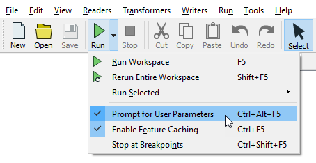
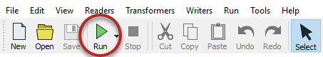



{{ template.exercise(1,
               "Opening and Running a Workspace",
               "Libraries (Esri Geodatabase) Roads (AutoCAD DWG)",
               "To open and run an FME workspace to explore what it can do with data",
               "Opening and running a workspace",
               "C:\\FMEData2019\\Workspaces\\DesktopBasic\\Basics-Ex1-Begin.fmw",
               "N/A")
}}

Rather than trying to explain what FME is and does, let's try it for ourselves!

**1) Locate Workspace File**
 When translations and transformations are defined in FME, they can be saved in a .fmw file.

Using a file explorer, browse to the file listed above:

Double-click on the file. It will open an application called FME Workbench.

 **2) Explore FME Workspace**
 In FME Workbench, dismiss any Getting Started dialog that may open by clicking "Don't Show Me Again."

The main part of the application will look like this (click to expand):

This part we call the canvas. It is where the translation and transformation of data is defined graphically. Although it might look complicated, it does not take much practice with FME to create workflows of this type.

Examine the left-hand side of the canvas:

This area is where we read data, in this case, a table of libraries from an Esri Geodatabase. It is the "E" (Extract) part of ETL.

Now look at the right-hand side:

This area is where we write data, in this case, a report of the libraries in HTML format. It is the "L" (Load) part of ETL.

In between the reader and writer are objects that transform data. They represent the "T" (Transform) part of ETL.

Labels and other annotations show us what the workspace does. It:

- Reads both roads (AutoCAD DWG) and libraries (Esri Geodatabase)
- Calculates the shortest road route taking in all libraries
- Creates circles whose diameter is relative to a library's book circulation
- Creates an HTML report and an HTML map of the libraries
- Writes the data to HTML and also to Esri Shapefile



Let's make sure you get the terminology right. The application itself is called FME "Workbench," but the process defined in the canvas window is called a "Workspace." The terms are so similar that they are easily confused.



 **3) Run FME Workspace**
 Let's run this workspace.

Before doing so, we want to control _how_ to run the workspace. By default, a feature called **Prompt for User Parameters** is turned on. We don't need this on for this course, so let's turn it off by clicking the dropdown arrow next to the Run button the toolbar, and clicking Prompt for User Parameters:

Now we are ready to run the workspace. Click on the green Run button on the Workbench toolbar:

The workspace will now run. As it does, you will see messages pass by in a log window. You may also see numbers appear on the canvas connections and green annotated icons on each object. We'll get to what these are for later!

 **4) Locate and Examine Output**
 Once the translation is complete, click on the HTML writer object on the canvas. Choose the option to Open Containing Folder:

In the Explorer dialog that opens you will find both the HTML output and the Shapefile dataset:

Open a web browser such as Firefox or Chrome. Open the output file created by FME (usually Ctrl+O or File &gt; Open is the easiest way). You will see a table of libraries, a graph of library statistics, and an interactive map showing where the libraries are located. All this has been generated by FME from the incoming Geodatabase points and attributes:



This small demonstration illustrates the power of FME. This workspace read data from multiple spatial datasets and wrote it out to datasets in both spatial and "tabular" formats. In between it carried out a series of transformations and spatial analyses, buffering and reprojecting the data, and creating added value and information.





<ul><li>Open an FME workspace</li>
<li>Run an FME workspace</li>
<li>Locate the output from an FME workspace</li></ul>


