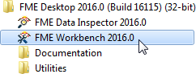
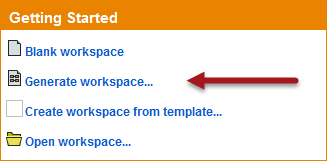
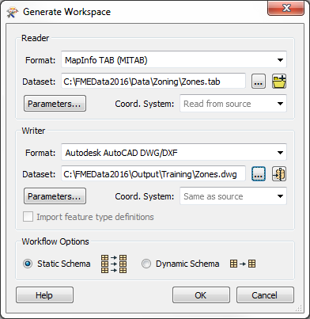
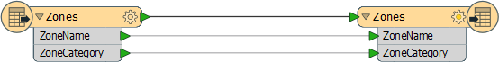
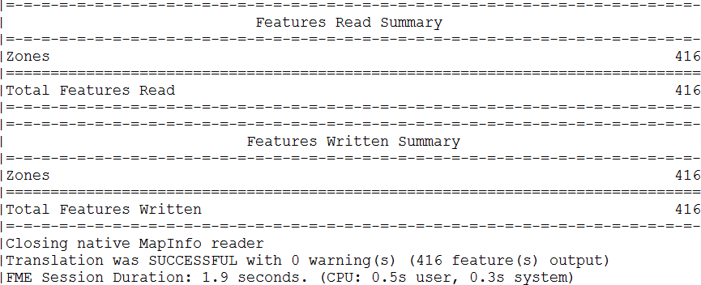
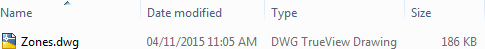

<!--Exercise Section-->
<!--NB: In GitBook world we don't give a number to exercises-->

<table style="border-spacing: 0px;border-collapse: collapse;font-family:serif">
<tr>
<td width=25% style="vertical-align:middle;background-color:darkorange;border: 2px solid darkorange">
<i class="fa fa-cogs fa-lg fa-pull-left fa-fw" style="color:white;padding-right: 12px;vertical-align:text-top"></i>
Exercise
</td>
<td style="border: 2px solid darkorange;background-color:darkorange;color:white">
Basic Workspace Creation
</td>
</tr>

<tr>
<td style="border: 1px solid darkorange; font-weight: bold">Data</td>
<td style="border: 1px solid darkorange">Zoning Data (MapInfo TAB)</td>
</tr>

<tr>
<td style="border: 1px solid darkorange; font-weight: bold">Overall Goal</td>
<td style="border: 1px solid darkorange">Create a workspace to translate zoning data in MapInfo TAB format to AutoCAD DWG</td>
</tr>

<tr>
<td style="border: 1px solid darkorange; font-weight: bold">Demonstrates</td>
<td style="border: 1px solid darkorange">Basic workspace creation with FME Workbench</td>
</tr>

<tr>
<td style="border: 1px solid darkorange; font-weight: bold">Start Workspace</td>
<td style="border: 1px solid darkorange">None</td>
</tr>

<tr>
<td style="border: 1px solid darkorange; font-weight: bold">End Workspace</td>
<td style="border: 1px solid darkorange">C:\FMEData2016\Workspaces\DesktopBasic\Basics-Ex1-Complete.fmw</td>
</tr>

</table>

Let's start using FME to do a simple file format translation. We’ve outlined all of the actions you need to take – although FME's interface is so intuitive you might be able to carry out the exercise without the need for step- by- step instructions. 

**1) Start FME Workbench**
 Start FME Workbench by selecting it from the Windows start menu. You’ll find it under Start > All Programs > FME Desktop 2016.0 > FME Workbench 2016.0.

 **2) Select Generate Workspace**
 FME Workbench will start up and begin with the Start tab active. In the Create Workspace part of the Start tab, select the option to Generate (Workspace). Alternatively you can use the shortcut Ctrl+G. 

 **3) Define Translation**
 The Generate Workspace tool opens up a dialog in which to define the translation to be carried out. Fill in the fields in this dialog as follows:

<table style="border: 0px">

<tr>
<td style="font-weight: bold">Reader Format</td>
<td style="">MapInfo TAB (MITAB)</td>
</tr>

<tr>
<td style="font-weight: bold">Reader Dataset</td>
<td style="">C:\FMEData2016\Data\Zoning\Zones.tab</td>
</tr>

<tr>
<td style="font-weight: bold">Writer Format</td>
<td style="">Autodesk AutoCAD DWG/DXF</td>
</tr>

<tr>
<td style="font-weight: bold">Writer Dataset</td>
<td style="">C:\FMEData2016\Output\Training\Zones.dwg</td>
</tr>

</table>

The dialog will look like this:

Remember, you can set a format by typing its name, by selecting it from the drop- down list, or by choosing “More Formats” and selecting the format from the full table of formats. For now, ignore the Workflow Options and leave the default of 'Static Schema.'

 **4) Generate and Examine Workspace**
 Click OK to close the Generate Workspace dialog. A new workspace will be generated into the FME Workbench canvas: 

Click the arrow icon on each object to expose a list of attributes in the data.

 **5) Run Workspace**
 Run the workspace by clicking the run button on the toolbar, or by using Run > Run Translation on the menubar. The translation will run and the log file reports something like this:

 **6) Locate Output**
 Locate the destination data in Windows Explorer to prove that it's been written as expected. In the next section we’ll cover how to inspect the dataset to ensure that it is correct.

---

<!--Tip Section--> 

<table style="border-spacing: 0px">
<tr>
<td style="vertical-align:middle;background-color:darkorange;border: 2px solid darkorange">
<i class="fa fa-info-circle fa-lg fa-pull-left fa-fw" style="color:white;padding-right: 12px;vertical-align:text-top"></i>
TIP
</td>
</tr>

<tr>
<td style="border: 1px solid darkorange">

When a translation is run immediately in Workbench or Quick Translator, without further adjustment, it's known as a 'Quick Translation.' 
  Because FME is a 'semantic' translator, with an enhanced data model, the output from a quick translation is as close to the source data in structure and meaning as possible, given the capabilities of the destination format.

</td>
</tr>
</table>

---

<!--Exercise Congratulations Section--> 

<table style="border-spacing: 0px">
<tr>
<td style="vertical-align:middle;background-color:darkorange;border: 2px solid darkorange">
<i class="fa fa-thumbs-o-up fa-lg fa-pull-left fa-fw" style="color:white;padding-right: 12px;vertical-align:text-top"></i>
CONGRATULATIONS
</td>
</tr>

<tr>
<td style="border: 1px solid darkorange">

By completing this exercise you have learned how to:
 
<ul><li>Create an FME workspace</li>
<li>Run an FME workspace</li></ul>

</td>
</tr>
</table>
