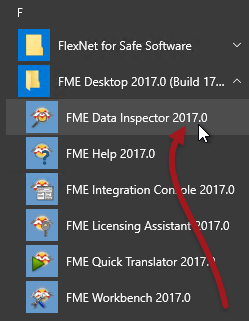
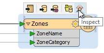

<!--Exercise Section-->
<!--NB: In GitBook world we don't give a number to exercises-->

<table style="border-spacing: 0px;border-collapse: collapse;font-family:serif">
<tr>
<td width=25% style="vertical-align:middle;background-color:darkorange;border: 2px solid darkorange">
<i class="fa fa-cogs fa-lg fa-pull-left fa-fw" style="color:white;padding-right: 12px;vertical-align:text-top"></i>
Exercise 2
</td>
<td style="border: 2px solid darkorange;background-color:darkorange;color:white">
Basic Data Inspection
</td>
</tr>

<tr>
<td style="border: 1px solid darkorange; font-weight: bold">Data</td>
<td style="border: 1px solid darkorange">Zoning Data (MapInfo TAB)</td>
</tr>

<tr>
<td style="border: 1px solid darkorange; font-weight: bold">Overall Goal</td>
<td style="border: 1px solid darkorange">Inspect the output from a previous translation</td>
</tr>

<tr>
<td style="border: 1px solid darkorange; font-weight: bold">Demonstrates</td>
<td style="border: 1px solid darkorange">Basic data inspection with the FME Data Inspector</td>
</tr>

<tr>
<td style="border: 1px solid darkorange; font-weight: bold">Start Workspace</td>
<td style="border: 1px solid darkorange">C:\FMEData2017\Workspaces\DesktopBasic\Basics-Ex1-Complete.fmw</td>
</tr>

<tr>
<td style="border: 1px solid darkorange; font-weight: bold">End Workspace</td>
<td style="border: 1px solid darkorange">None</td>
</tr>

</table>

In the previous exercise you were asked to convert some data between formats. Before you send the converted data out you should really inspect it to make sure it is correct. If you haven't been trying it already, let’s see how the FME Data Inspector interface works by inspecting the output from that quick translation.

**1) Start FME Data Inspector**
 Start the FME Data Inspector by selecting it from the Windows start menu. You’ll find it under Start > All Programs > FME Desktop 2016.0 > FME Data Inspector 2016.0.

 **2) Select Dataset**
 The FME Data Inspector will start up and begin with an empty view display.

To open a dataset, select File > Open Dataset from the menubar.
When prompted, fill in the fields in the Select Dataset dialog as follows:

<table style="border: 0px">

<tr>
<td style="font-weight: bold">Reader Format</td>
<td style="">Autodesk AutoCAD DWG/DXF</td>
</tr>

<tr>
<td style="font-weight: bold">Reader Dataset</td>
<td style="">C:\FMEData2017\Output\Training\Zones.dwg</td>
</tr>

</table>

**NB:** *If you can't find the dataset - maybe you didn't complete the first exercise, or wrote the data to a different location - then you can open the original zoning dataset as:*

<table style="border: 0px">

<tr>
<td style="font-weight: bold">Reader Format</td>
<td style="">MapInfo TAB (MITAB)</td>
</tr>

<tr>
<td style="font-weight: bold">Reader Dataset</td>
<td style="">C:\FMEData2017\Data\Zoning\Zones.tab</td>
</tr>

</table>

 **3) Open Dataset**
 The dataset should look something like this:

 **4) Browse Data**
 Use the windowing tools on the toolbar to browse through the dataset, inspecting it closely. Use the Query tool to query individual features and inspect the information in the Feature Information Window.

Try right-clicking in the different Data Inspector windows, to discover functionality that exists on context menus.

 **5) Open Data from Within Workbench**
 Back in FME Workbench, open the workspace from the previous exercise.

Click on any Reader or Writer feature type and a small pop-up menu has an option to 'Inspect'. This alternative method of opening a dataset in the Data Inspector is very convenient when you are already using FME Workbench.

---

<!--Tip Section--> 

<table style="border-spacing: 0px">
<tr>
<td style="vertical-align:middle;background-color:darkorange;border: 2px solid darkorange">
<i class="fa fa-info-circle fa-lg fa-pull-left fa-fw" style="color:white;padding-right: 12px;vertical-align:text-top"></i>
TIP
</td>
</tr>

<tr>
<td style="border: 1px solid darkorange">

Similar to the above, you can locate the output dataset by clicking the pop-up option to Open Containing Folder. 

</td>
</tr>
</table>

---

<!--Exercise Congratulations Section--> 

<table style="border-spacing: 0px">
<tr>
<td style="vertical-align:middle;background-color:darkorange;border: 2px solid darkorange">
<i class="fa fa-thumbs-o-up fa-lg fa-pull-left fa-fw" style="color:white;padding-right: 12px;vertical-align:text-top"></i>
CONGRATULATIONS
</td>
</tr>

<tr>
<td style="border: 1px solid darkorange">

By completing this exercise you have learned how to:
 
<ul><li>Open datasets in a new view in the FME Data Inspector</li>
<li>Use the windowing and inspection tools in the FME Data Inspector</li>
<li>Use FME Workbench functionality to open a dataset in the FME Data Inspector</li></ul>

</td>
</tr>
</table>
