<!--Exercise Section-->
<!--NB: In GitBook world we don't give a number to exercises-->

<table style="border-spacing: 0px;border-collapse: collapse;font-family:serif">
<tr>
<td style="vertical-align:middle;background-color:darkorange;border: 2px solid darkorange">
<i class="fa fa-cogs fa-lg fa-pull-left fa-fw" style="color:white;padding-right: 12px;vertical-align:text-top"></i>
Exercise
</td>
<td style="border: 2px solid darkorange;background-color:darkorange;color:white">
The FME Data Inspector
</td>
</tr>

<tr>
<td style="border: 1px solid darkorange; font-weight: bold">Data</td>
<td style="border: 1px solid darkorange">Parks (MapInfo TAB) Fire Halls (GML - Geographic Markup Language) Neighborhoods (Google Earth KML)</td>
</tr>

<tr>
<td style="border: 1px solid darkorange; font-weight: bold">Overall Goal</td>
<td style="border: 1px solid darkorange">Examine city data to select a suitable neighborhood to live in</td>
</tr>

<tr>
<td style="border: 1px solid darkorange; font-weight: bold">Demonstrates</td>
<td style="border: 1px solid darkorange">Viewing, symbolizing, and querying data with the FME Data Inspector</td>
</tr>

<tr>
<td style="border: 1px solid darkorange; font-weight: bold">Start Workspace</td>
<td style="border: 1px solid darkorange">None</td>
</tr>

<tr>
<td style="border: 1px solid darkorange; font-weight: bold">End Workspace</td>
<td style="border: 1px solid darkorange">None</td>
</tr>

</table>

In this exercise, imagine that you are a GIS technician working for a city planning department. The mayor has asked you to help him use FME to inspect some data, to pick a neighborhood for him to buy a new house in!

 **1) Start FME Data Inspector**
 Start the FME Data Inspector

 **2) Set Background**
 When inspecting data it will help to have a background map to provide a sense of location. The FME Data Inspector is capable of displaying a backdrop from several different mapping services.

Select Tools > FME Options from the menubar. In the Background Map section, select a background map format of MapQuest Web Map Tile Service:

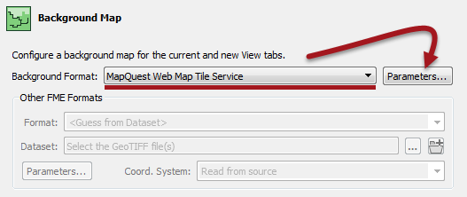

Click the Parameters button. A map constraint (type) dialog will open. Select OpenStreetMap.

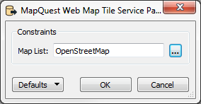

Click OK and OK again to close these dialogs.

 **3) Add Data**
 Now let's add some data. Select File > Open Dataset from the menubar. Set the reader parameters as follows:

<table style="border: 0px">

<tr>
<td style="font-weight: bold">Reader Format</td>
<td style="">Google Earth KML</td>
</tr>

<tr>
<td style="font-weight: bold">Reader Dataset</td>
<td style="">C:\FMEData2016\Data\Boundaries\VancouverNeighborhoods.kml</td>
</tr>

</table>

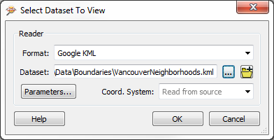

Click OK to close the dialog and add the data.

 **4) Set Data Symbology**
 The data is added to the Data Inspector, but it is a solid-filled color and therefore obscures the background data.

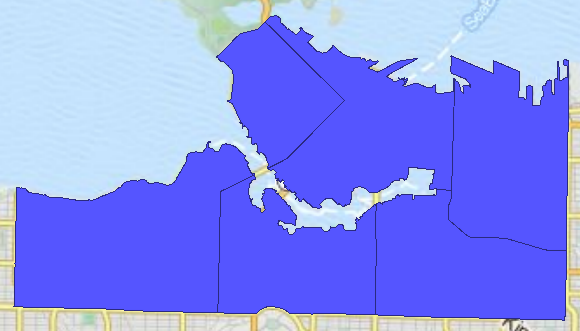
 Tiles Courtesy of <a href="http://www.mapquest.com/">MapQuest</a> 

We can fix this by setting the symbology. Click the symbology icon for the Neighborhoods data in the Display Control window:

In the style dialog that opens, select a suitable color for the neighborhoods (say, orange). Then set the Transparency/Opacity scale to be somewhat less than half (i.e. more transparent than opaque).

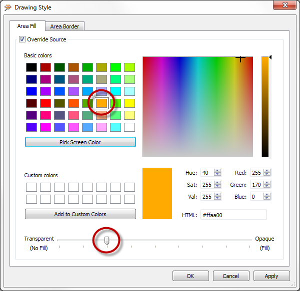

Click OK to accept the parameters and close the dialog. The background map will now be visible through the neighborhood data.

 **5) Add More Data**
 The mayor has a pet dog and therefore wishes to live in an area that has a dog park. We must therefore add some parks data to the view.

Select File > Add Dataset from the menubar. Set the reader parameters as follows:

<table style="border: 0px">

<tr>
<td style="font-weight: bold">Reader Format</td>
<td style="">MapInfo TAB (MITAB)</td>
</tr>

<tr>
<td style="font-weight: bold">Reader Dataset</td>
<td style="">C:\FMEData2016\Data\Parks\Parks.tab</td>
</tr>

</table>

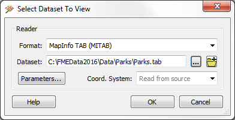

Click OK to close the dialog and add the data.

 **6) Filter Data**
 The parks data is opaque too (you may optionally change this to be more transparent) but more importantly we cannot tell which parks are dog parks.

Click on the tab marked Parks in the Table View window.

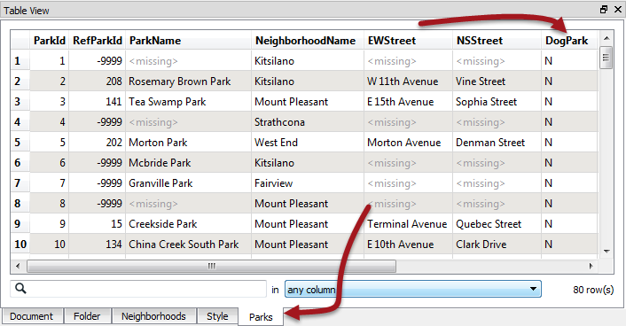

Notice that there are many parks in the city, but that there is also a DogPark attribute to tell us which parks have a dog run area. Click on the DogPark name to sort the table data by that attribute.

Now we know which are dog parks, clicking on a feature will highlight it on the display window. However, it would be easier to find dog parks if we could filter the data. Therefore choose Tools > Filter Features from the menubar.

In the Filter Features dialog, double click in the Left Value field, click the drop down arrow, and select Attribute Value. Choose DogPark as the attribute to filter by and click OK.

For the Operator field select the = (equals) symbol, if it is not already selected.

For the Right Value field, click in the field and type the character Y (it should be upper case, not lower).

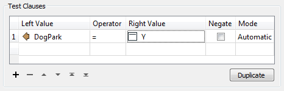

Filtering in the Data Inspector is applied to all visible data, therefore we must also add a clause to enable the neighborhood data to remain on screen.

Create a second test clause using the same techniques as before. This time test for where NeighborhoodID > (is greater than) 0 (zero)

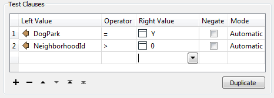

The Pass Criteria parameter should be set (or left as) "One Test (OR)."

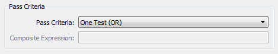

Now click OK to close the dialog. The display will be filtered to show only the neighborhood features plus parks with a dog run facility.

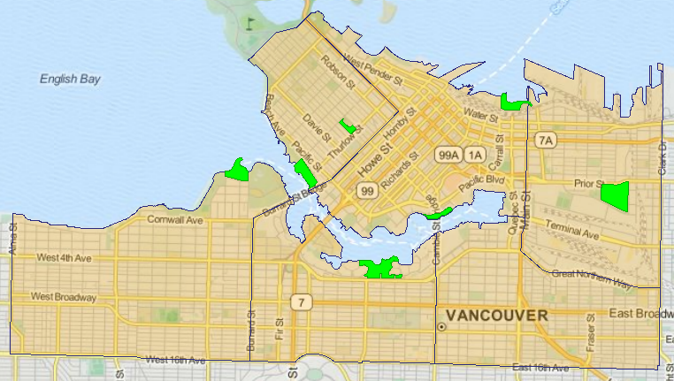
 Tiles Courtesy of <a href="http://www.mapquest.com/">MapQuest</a>

 **7) Add Data**
 The mayor's dog really is his best friend, and the mayor refuses to live in an area where there are no rescue services, just in case he gets lost chasing a cat! So let's add some emergency facilities data.

Select File > Add Dataset from the menubar. Set the reader parameters as follows:

<table style="border: 0px">

<tr>
<td style="font-weight: bold">Reader Format</td>
<td style="">GML (Geography Markup Language)</td>
</tr>

<tr>
<td style="font-weight: bold">Reader Dataset</td>
<td style="">C:\FMEData2016\Data\Emergency\FireHalls.gml</td>
</tr>

</table>

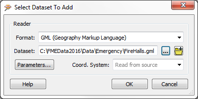

Click OK to close the dialog and add the data.

 **8) Filter Data**
 Initially no data will appear on screen because we already have a filter set that will exclude it.

So, again select Tools > Filter Features from the menubar.
This time set up a test to filter where Rescue = Y (i.e. Fire Halls which are also a rescue facility).

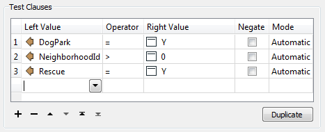

At this point you should be able to suggest to the mayor a neighborhood that has both a dog park and an emergency rescue facility. Click on the neighborhood feature to find out which it is.

---

<!--Exercise Congratulations Section--> 

<table style="border-spacing: 0px">
<tr>
<td style="vertical-align:middle;background-color:darkorange;border: 2px solid darkorange">
<i class="fa fa-thumbs-o-up fa-lg fa-pull-left fa-fw" style="color:white;padding-right: 12px;vertical-align:text-top"></i>
CONGRATULATIONS
</td>
</tr>

<tr>
<td style="border: 1px solid darkorange">

By completing this exercise you have learned how to:
  <li>Set a background map for the FME Data Inspector
 <li>Add datasets to an existing view in the FME Data Inspector
 <li>Set symbology for features in the FME Data Inspector
 <li>Query and sort data in the Data Inspector Table View window
 <li>Filter data using test clauses in the FME Data Inspector

</td>
</tr>
</table>