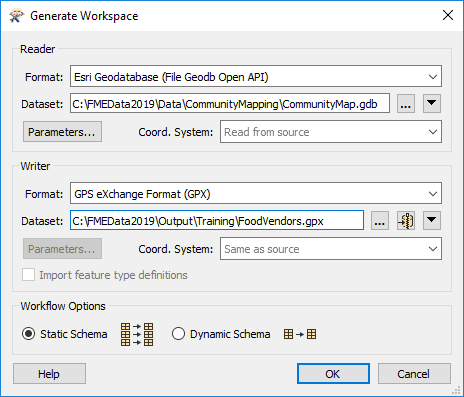
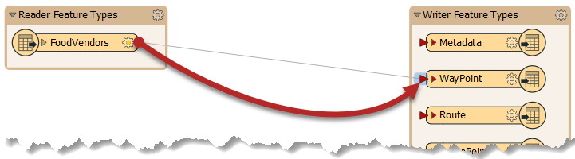
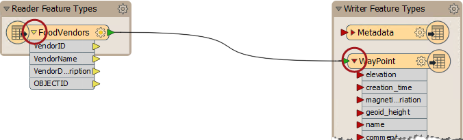
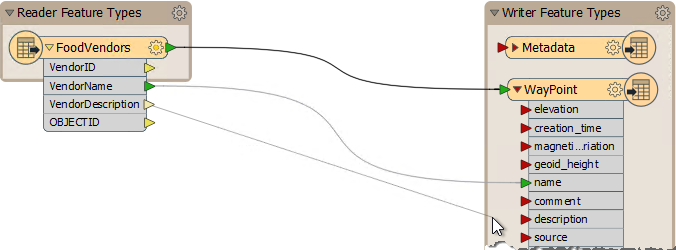
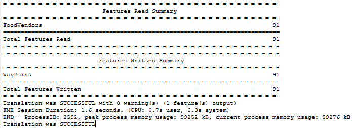
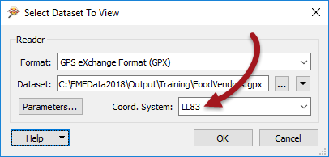
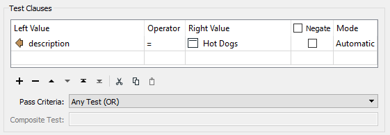

<!--Exercise Section-->

<table style="border-spacing: 0px;border-collapse: collapse;font-family:serif">
<tr>
<td width=25% style="vertical-align:middle;background-color:darkorange;border: 2px solid darkorange">
<i class="fa fa-cogs fa-lg fa-pull-left fa-fw" style="color:white;padding-right: 12px;vertical-align:text-top"></i>
Exercise 5
</td>
<td style="border: 2px solid darkorange;background-color:darkorange;color:white">
Tourist Bureau Project
</td>
</tr>

<tr>
<td style="border: 1px solid darkorange; font-weight: bold">Data</td>
<td style="border: 1px solid darkorange">Community Mapping/Food Vendors (Esri Geodatabase)</td>
</tr>

<tr>
<td style="border: 1px solid darkorange; font-weight: bold">Overall Goal</td>
<td style="border: 1px solid darkorange">Create a GPS-compatible dataset of food vendors for the local tourist bureau</td>
</tr>

<tr>
<td style="border: 1px solid darkorange; font-weight: bold">Demonstrates</td>
<td style="border: 1px solid darkorange">Basic Data Translation and Data Inspection</td>
</tr>

<tr>
<td style="border: 1px solid darkorange; font-weight: bold">Start Workspace</td>
<td style="border: 1px solid darkorange">None</td>
</tr>

<tr>
<td style="border: 1px solid darkorange; font-weight: bold">End Workspace</td>
<td style="border: 1px solid darkorange">C:\FMEData2018\Workspaces\DesktopBasic\Basics-Ex5-Complete.fmw</td>
</tr>

</table>

You've barely started in your new job, but requests are coming in fast! 

The local tourist bureau is running a promotion where they provide tourists with a GPS device to help them visit street food vendors in the city. Your manager wonders whether you can use FME to produce the data to be used in this scheme.

Let's get onto that right away shall we?

 **1) Start FME Workbench**
 Start FME Workbench. In the Create Workspace section of the Start window, choose the option to Generate (Workspace). When prompted generate a translation with the following parameters:

<table style="border: 0px">

<tr>
<td style="font-weight: bold">Reader Format</td>
<td style="">Esri Geodatabase (File Geodb Open API)</td>
</tr>

<tr>
<td style="font-weight: bold">Reader Dataset</td>
<td style="">C:\FMEData2018\Data\CommunityMapping\CommunityMap.gdb</td>
</tr>

<tr>
<td style="font-weight: bold">Writer Format</td>
<td style="">GPS eXchange Format (GPX)</td>
</tr>

<tr>
<td style="font-weight: bold">Writer Dataset</td>
<td style="">C:\FMEData2018\Output\Training\FoodVendors.gpx</td>
</tr>

</table>

Click OK to accept the parameters. When prompted which tables to use from the source data (there are several) deselect all tables except for FoodVendors and click OK to create the workspace.

 **2) Connect Reader/Writer**
 When first created, the reader and writer are not connected in this workspace. Connect them by dragging a connection from the output port of the reader feature type to the input port of the writer feature type labelled WayPoint:

Click the expand buttons on the two objects to expose the list of attributes on each:

Now drag a connection between the Reader attribute *VendorName* and the writer attribute *name*. Repeat the process for *VendorDescription* and *description*:

The technique of connecting objects like this is called Schema Mapping, and we shall learn more about it later.

 **3) Run Workspace**
 Save the workspace so you have a copy of it, then run the workspace by pressing the green run button. The workspace runs and the data is written to a Garmin POI dataset:

 **4) Inspect Data**
 Go to the FME Data Inspector. Select File &gt; Open Dataset from the menubar. This opens the dialog titled "Select Dataset to View". 

Set the format type and select the GPX dataset. However, the GPX format does not record its coordinate system inside the dataset, so to include a background map you must also set the coordinate system (LL83) in this dialog.

***NB:*** *Because of the coordinate system limitation for this format, you can't use the Inspect options inside Workbench. That's because the data will be passed directly to the Data Inspector without the option to set the coordinate system. You have to open it manually as above.*

Click OK and the dataset will be opened for you to verify that it is correct.

<!-- **5) Filter Data**
 All this talk of food is making you hungry. It must be lunchtime. To find somewhere to get a quick lunch filter the data to show hot dog vendors in the city:

--> 

---

<!--Exercise Congratulations Section--> 

<table style="border-spacing: 0px">
<tr>
<td style="vertical-align:middle;background-color:darkorange;border: 2px solid darkorange">
<i class="fa fa-thumbs-o-up fa-lg fa-pull-left fa-fw" style="color:white;padding-right: 12px;vertical-align:text-top"></i>
CONGRATULATIONS
</td>
</tr>

<tr>
<td style="border: 1px solid darkorange">

By completing this exercise you proved you know how to:
 
<ul><li>Create and run a workspace in FME Workbench</li>
<li>Carry out basic 'schema mapping' in FME Workbench</li>
<li>Open a dataset in the FME Data Inspector</li>
<!--<li>Filter data using test clauses in the FME Data Inspector</li>--> </ul>

</td>
</tr>
</table>
