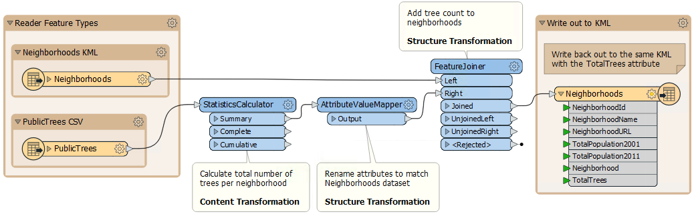

# What is Data Transformation?
**Data Transformation** is FME's ability to manipulate data. The transformation step occurs during the process of format translation. Data is read, transformed, and then written to the chosen format.

## Data Transformation Types
Data transformation can be subdivided into two distinct types: *Structural Transformation* and *Content Transformation*.

### Structural Transformation
Structural transformation is perhaps better called ‘reorganization'. It refers to FME's ability to channel data from source to destination in an almost infinite number of arrangements.

This includes the ability to merge data (as in the image above), divide data, re-order data, and define custom data structures.

Transforming the structure of a dataset is carried out by manipulating its schema.

### Content Transformation
Content transformation is perhaps better called ‘revision.' It refers to the ability to alter the content of a dataset.

Manipulating a feature's geometry or calculating new attribute values is the best example of how FME can transform content.

Content transformation can take place independently or alongside structural transformation:

