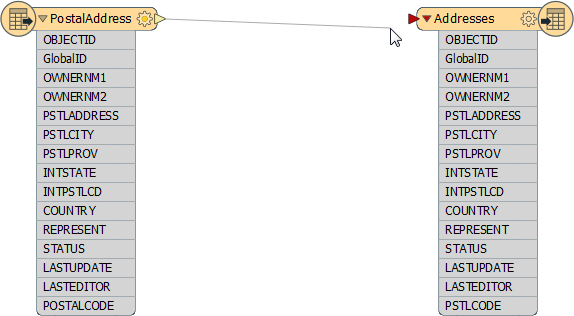
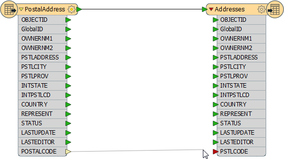
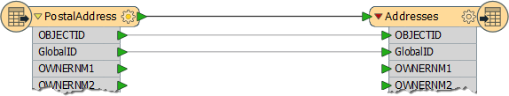

# Schema Mapping

Schema Mapping is the second key part towards data restructuring in FME.

In FME Workbench, one side of the workspace shows the source schema (*"what we have"*) and the other side shows the destination schema (*"what we want"*). Initially the two schemas are automatically joined when the workspace is created, but when edits occur then these connections are usually lost.

***Schema Mapping*** is the process of connecting the source schema to the destination schema in a way that ensures the correct Reader features are sent to the correct Writer feature types and the correct Reader attributes are sent to the correct Writer attributes.

In FME, it is permitted to do this mapping in any way that is desired.

---

<!--Person X Says Section-->

<table style="border-spacing: 0px">
<tr>
<td style="vertical-align:middle;background-color:darkorange;border: 2px solid darkorange">
<i class="fa fa-quote-left fa-lg fa-pull-left fa-fw" style="color:white;padding-right: 12px;vertical-align:text-top"></i>
Ms. Analyst says...
</td>
</tr>

<tr>
<td style="border: 1px solid darkorange">

Hi. I'm Ms. Analyst, one of your colleagues at the city. I think of Schema Editing and Mapping as a means of reorganizing data.
  A good analogy is a wardrobe full of clothes. When the wardrobe is reorganized you throw out what you no longer need, reserve space for new stuff that you’re planning to get, and move existing items into a more usable arrangement.
  The same holds true for spatial data restructuring: it's the act of reorganizing data to make it more usable.
  In Workbench’s intuitive interface, the most common way to make feature type and attribute connections is by dragging connecting lines between these parts of the schema.

</td>
</tr>
</table>

---

## Feature Mapping
***Feature mapping*** is the process of connecting source feature types to destination feature types.

Feature Mapping is carried out by clicking the output port of a source feature type, dragging the arrowhead across to the input port of a destination feature type, and releasing the mouse button.

Here, a connecting line from source to destination feature type is created by dragging the arrowhead from the source to the destination.

Merging and splitting of data is permitted. Here, a user wishes to create a single layer called Transportation and so is merging two input feature types (Roads and Rail) into one output feature type (Transportation).

---

## Attribute Mapping
***Attribute Mapping*** is the process of connecting Reader attributes to Writer attributes.

Attribute Mapping is performed by clicking the output port of a Reader attribute, dragging the arrowhead to the input port of a Writer attribute, and releasing the mouse button.

Here feature mapping has been carried out already and attribute connections are being made.

Notice the green, yellow, and red color-coding that indicates which attributes are connected.

Green ports indicate a connected attribute. Yellow ports indicate a Reader attribute that’s unconnected to a Writer. Red ports indicate a Writer attribute that’s unconnected to by a Reader.

Feature mapping connections (or links) are shown with a thick, black arrow.

Attribute mapping connections are shown with a thinner, gray arrow.

Attributes with the same name in Reader and Writer are connected automatically, even though a connecting line might not be visible; the port color is the key.

---

<!--Warning Section--> 

<table style="border-spacing: 0px">
<tr>
<td style="vertical-align:middle;background-color:darkorange;border: 2px solid darkorange">
<i class="fa fa-exclamation-triangle fa-lg fa-pull-left fa-fw" style="color:white;padding-right: 12px;vertical-align:text-top"></i>
WARNING
</td>
</tr>

<tr>
<td style="border: 1px solid darkorange">

Names are case-sensitive, therefore ROADS is not the same as roads, Roads, or rOADS.
 That's important to know if you are relying on automatic attribute connections!

</td>
</tr>
</table>