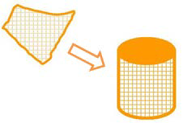

# Content Transformation #

Content transformations are those that operate on the geometry or attribute content of a dataset.

 
## What is a Feature? ##
A feature in FME is an individual item within the translation. It is the fundamental (that is, smallest) unit of FME data.

Typically a GIS or cartographic feature consists of a geometric representation plus a set of related attributes. FME is capable of restructuring either of these components.

Sometimes content transformation operates on single features, sometimes on multiple features at once.

Features in FME have a flexible, generic representation that is unrelated to the format from which they originated. That means any transformer can operate on any FME feature, regardless of its source format.

---

<!--Person X Says Section-->

<table style="border-spacing: 0px">
<tr>
<td style="vertical-align:middle;background-color:darkorange;border: 2px solid darkorange">
<i class="fa fa-quote-left fa-lg fa-pull-left fa-fw" style="color:white;padding-right: 12px;vertical-align:text-top"></i>
Ms. Analyst says...
</td>
</tr>

<tr>
<td style="border: 1px solid darkorange">

You can think of Content Transformation as altering or editing data.
  The wardrobe analogy still works here. You might take your clothes from the wardrobe to clean them, or alter them, or repair them, or dye them a new color, or all sorts of other tasks, before returning them to their place.
  The same holds true for spatial data transformation: it's the act of fixing up your data to be cleaner and in the style you really want

</td>
</tr>
</table>

---

## Geometric Transformation ##
***Geometric Transformation*** is the act of restructuring the spatial component of an FME feature. In other words, the physical geometry of the feature undergoes some form of change to produce a different output.

Some examples of geometric transformation include the following:

- **Generalization** – a cartographic process that restructures data so it's easily visualized at a given map scale.
- **Warping** – adjustment of the size and shape of a set of features to more closely match a set of reference data.
- **Topology Computation** – conversion of a set of linear features into a node/line structure.

Line Intersection is another example of geometric transformation.

Here roads have been intersected with rivers to produce points that mark the location of bridges.

## Attribute Transformation ##
***Attribute Transformation*** is the act of restructuring the non-spatial component of an FME feature. In other words, the attributes relating to the physical geometry undergo some form of change to produce a different output.

Some examples of attribute transformation are:

- **Concatenation** – joining together of two or more attributes
- **Splitting** – splitting one attribute into many, which is the opposite of Concatenation
- **Measurement** – measuring a feature's length or area to create a new attribute
- **ID Creation** – creating a unique ID number for a particular feature

Attribute concatenation as an example of attribute transformation.

Each line of the address is concatenated to return a single line address.
>  	Address1 	Suite 2017,+
> 	Address2 	7445-132nd Street,+
> 	City  	  	Surrey,+
> 	Province 	British Columbia,+
> 	PostalCode 	V3W 1J8
> 	
> 	= Address 	Suite 2017, 7445-132nd Street,Surrey, British Columbia, V3W 1J8

---

<!--Person X Says Section-->

<table style="border-spacing: 0px">
<tr>
<td style="vertical-align:middle;background-color:darkorange;border: 2px solid darkorange">
<i class="fa fa-quote-left fa-lg fa-pull-left fa-fw" style="color:white;padding-right: 12px;vertical-align:text-top"></i>
Miss Vector says...
</td>
</tr>

<tr>
<td style="border: 1px solid darkorange">

Did you miss me? You did? Well I'll cure that with some new questions for you!
  Which three colours represent checked, need checking, and unset parameters on transformer objects?
  1. blue, yellow, red
 2. green, yellow, red
 3. red, green, blue
 4. green, blue, yellow
  If I use a transformer to remove irregularities (like self-intersecting loops) in the boundary of a polygon, what type of transformation is it? 
  1. Structural Transformation of attributes
 2. Structural Transformation of geometry
 3. Content Transformation of attributes
 4. Content Transformation of geometry

</td>
</tr>
</table>

---