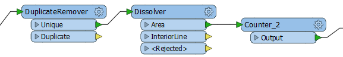

# Transformers used in Series #
Much like a set of components in an electrical circuit, a series of Workbench Transformers can be connected together to have a cumulative effect on a set of data.

 
## Chaining Transformers ##
Even with the large number of transformers available in FME, users frequently need a combination or chain of transformers instead of a single one.

A string of transformers that graphically represent an overall workflow is a key concept of FME.

In this example, a DuplicateFilter transformer removes duplicate polygon features. A Dissolver transformer merges each remaining (unique) polygon with its neighbor where there is a common boundary. Finally each merged area gains an ID number from the Counter transformer.

---

<!--Updated Section--> 

<table style="border-spacing: 0px">
<tr>
<td style="vertical-align:middle;background-color:darkorange;border: 2px solid darkorange">
<i class="fa fa-bolt fa-lg fa-pull-left fa-fw" style="color:white;padding-right: 12px;vertical-align:text-top"></i>
.1 UPDATE
</td>
</tr>

<tr>
<td style="border: 1px solid darkorange">

The Counter transformer in the above screenshot gained its &lt;Rejected&gt; port in FME2016.1

</td>
</tr>
</table>

---