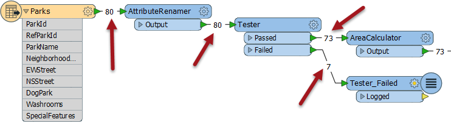

## Feature Count Display##
Look back at the previous example's translation. Did you notice that while the workspace was running, each connection was updated with the number of features that had passed along it?

The final feature counts show that 80 features were read, 73 passed the Tester while 7 failed (for being dog parks) and went on to the Logger.

The Log window confirms the number of features written and lists the features that failed the Tester.

This number helps analyze the results of a workspace and provides a reference for debugging if the destination data differs from what was expected.

---

<!--Updated Section--> 

<table style="border-spacing: 0px">
<tr>
<td style="vertical-align:middle;background-color:darkorange;border: 2px solid darkorange">
<i class="fa fa-bolt fa-lg fa-pull-left fa-fw" style="color:white;padding-right: 12px;vertical-align:text-top"></i>
.1 UPDATE
</td>
</tr>

<tr>
<td style="border: 1px solid darkorange">

The AreaCalculator transformer in the above screenshot gained a &lt;Rejected&gt; port in FME2016.1

</td>
</tr>
</table>

---