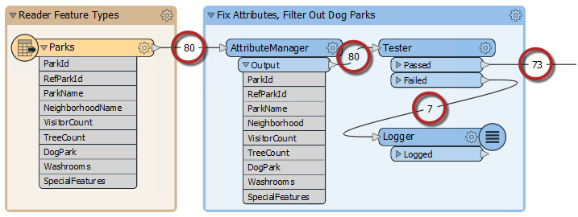

## Feature Count Display##
Look back at the previous example's translation. Did you notice that while the workspace was running, each connection was updated with the number of features that had passed along it?

The final feature counts show that 80 features were read, 73 passed the Tester while 7 failed (for being dog parks) and went on to the Logger.

The Log window confirms the number of features written and lists the features that failed the Tester.

These numbers help analyze the results of a workspace and provide a reference for debugging if the output differs from what was expected.